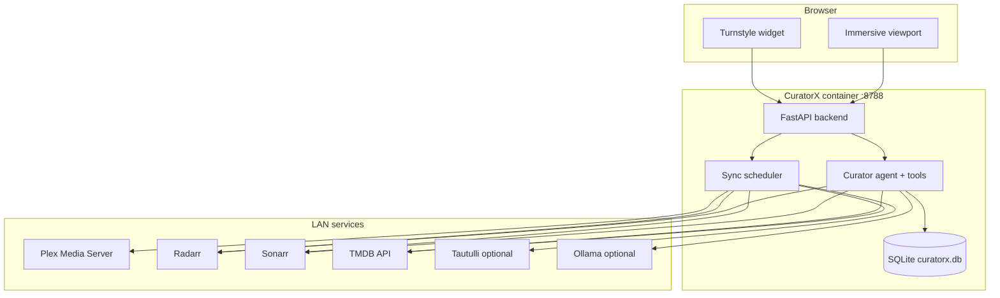

# CuratorX

[](LICENSE)
[](https://www.python.org/downloads/)
[](docs/DOCKER.md)

**An intent-aware curation companion for self-hosted Plex libraries.**

CuratorX turns your homelab from a passive download queue into a context-aware curator. It knows what you own, learns taste within isolated **curation lenses**, and recommends hidden gems, collection gaps, and purge candidates — then adds titles to Radarr/Sonarr only after you confirm.

> Dumb recommenders average everything you ever watched. CuratorX sandboxes taste by lens so a late-night comfort binge never poisons your director-study discovery lane.

---

## Table of contents

- [Why CuratorX](#why-curatorx)
- [Features](#features)
- [Homelab stack](#homelab-stack)
- [Quick start](#quick-start)
- [Curation lenses](#curation-lenses)
- [Persona tuning](#persona-tuning)
- [Dual UI modes](#dual-ui-modes)
- [Screenshots](#screenshots)
- [Documentation](#documentation)
- [Contributing](#contributing)
- [License](#license)

---

## Why CuratorX

| Typical recommender | CuratorX |
|---------------------|----------|
| One global taste profile | **Lens isolation** — separate contexts (General, Director Studies, 70s Exploitation, …) |
| “Top 10 on Netflix” vibes | **Library-grounded RAG** — answers from what you own and watch |
| Opaque scores | **Explainable cards** — every title carries a `recommendation_reason` |
| Auto-grab everything | **Confirmation-gated *arr** — Radarr/Sonarr writes need explicit approval |
| Vendor-locked AI | **BYOP LLM** — OpenAI, Anthropic, Ollama, or any OpenAI-compatible endpoint |

CuratorX complements disk tools like [Reclaimspace](https://github.com/romwil/reclaimspace): Reclaimspace quarantines duplicate files; CuratorX helps you decide *what* deserves the space.

---

## Features

- **Chat-first curator** — natural-language discovery, gap analysis, purge advice, and “what to watch tonight”
- **Curation lenses** — hard algorithmic walls between taste contexts; chat history and telemetry scoped by `lens_id`
- **Dynamic persona** — name your curator and tune tone sliders (bro↔professorial, diplomatic↔snarky, passive↔autonomous)
- **Dual UI** — compact **Turnstyle** command lane for fast intent entry; **Immersive** viewport for deep browsing
- **RAG over Plex** — semantic search with embeddings over your indexed library
- **Metadata enrichment** — TMDB, TVDB, Fanart.tv, optional Tautulli watch stats
- **Safe automation** — short-lived confirmation tokens for all Radarr/Sonarr mutations
- **Unraid-ready** — single Docker container, SQLite persistence, Community Applications template

---

## Homelab stack



See [Architecture](docs/ARCHITECTURE.md) for component diagrams, data flows, and security model.

---

## Quick start

### Docker (recommended)

```bash
git clone https://github.com/romwil/curatorx.git
cd curatorx
cp .env.example .env
docker compose up -d --build
```

Open **http://localhost:8788** and complete the setup wizard.

### Local development

```bash
python3.12 -m venv .venv
source .venv/bin/activate
pip install -e ".[web]"
cd frontend && npm install && npm run build && cd ..
DATA_DIR=./config python -m curatorx.web
```

Open **http://localhost:8788**.

---

## Curation lenses

Every chat session, taste vector, and telemetry event carries a **`lens_id`**. The default lens is `general`.

Lenses prevent **context contamination**: watch history and chat under a casual lens cannot drift recommendations in a curated study lens unless you explicitly bridge them.

```bash
# API examples (after setup)
curl http://localhost:8788/api/lenses
curl http://localhost:8788/api/lenses/active
curl -X PUT http://localhost:8788/api/lenses/active -H 'Content-Type: application/json' -d '{"lens_id":"general"}'
```

Create custom lenses from Settings or `POST /api/lenses`. Full schema in [Data model](docs/DATA_MODEL.md).

---

## Persona tuning

CuratorX hot-reloads your companion’s identity without redeploying:

| Slider | Range | Effect |
|--------|-------|--------|
| Vocabulary density | Bro (0.0) → Professorial (1.0) | Word choice and depth |
| Interaction friction | Diplomatic (0.0) → Snarky (1.0) | Tone and pushback |
| Automation autonomy | Passive (0.0) → Autonomous (1.0) | How eagerly it proposes *arr actions |

Set curator name and sliders in **Settings** (`/config`) or via `GET/PUT /api/persona`.

---

## Dual UI modes

| Mode | Purpose | Key UX |
|------|---------|--------|
| **Turnstyle** | Fast intent entry | Monospace command lane, lens prefix (`⧉ [General] > _`), thoughtstream feed |
| **Immersive** | Deep curation | Sidebar lens switcher, lens-scoped chat, visual title clusters |

Toggle with expansion hotkey, `/expand`, or viewport card click. Details in [Design](docs/DESIGN.md) and [Web UI](docs/WEB_UI.md).

---

## Screenshots

> Placeholders — replace with captures from your install.

| Turnstyle widget | Immersive viewport |
|------------------|-------------------|
| _Screenshot: compact command lane with lens prefix_ | _Screenshot: sidebar + chat + title card grid_ |

| Setup wizard | Title detail |
|--------------|--------------|
| _Screenshot: persona sliders and service validation_ | _Screenshot: backdrop hero with purge note_ |

---

## Documentation

| Doc | Description |
|-----|-------------|
| [Product PRD](docs/curatorx_prd.md) | Vision, lens framework, persona, dual UI spec |
| [Architecture](docs/ARCHITECTURE.md) | System context, data flows, deployment |
| [Design](docs/DESIGN.md) | Principles, UX, agent tools, API surface |
| [Data model](docs/DATA_MODEL.md) | SQLite schema, lenses, persona tables |
| [Configuration](docs/CONFIGURATION.md) | Environment variables and settings |
| [Onboarding](docs/ONBOARDING.md) | First-run checklist |
| [Docker / Unraid](docs/DOCKER.md) | Container deployment |
| [Web UI](docs/WEB_UI.md) | Routes and API highlights |

---

## Contributing

Contributions welcome — especially lens presets, agent blueprints, connector hardening, and UI polish.

1. Fork [romwil/curatorx](https://github.com/romwil/curatorx)
2. Create a feature branch: `git checkout -b feat/your-idea`
3. Install dev deps: `pip install -e ".[web]"` and `cd frontend && npm install`
4. Run tests: `python -m unittest discover -s tests -v`
5. Open a PR with a clear description and test plan

Phase 1 ships backend foundations (`curatorx` package, default `general` lens, persona API). Frontend dual UI is evolving in parallel — coordinate on [issues](https://github.com/romwil/curatorx/issues) before large UI refactors.

---

## License

MIT — see [LICENSE](LICENSE).
