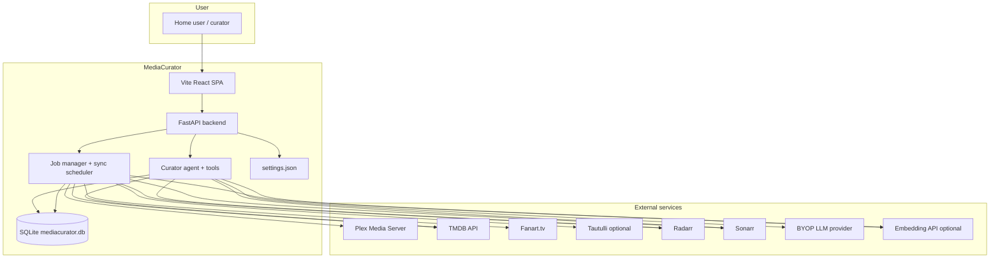
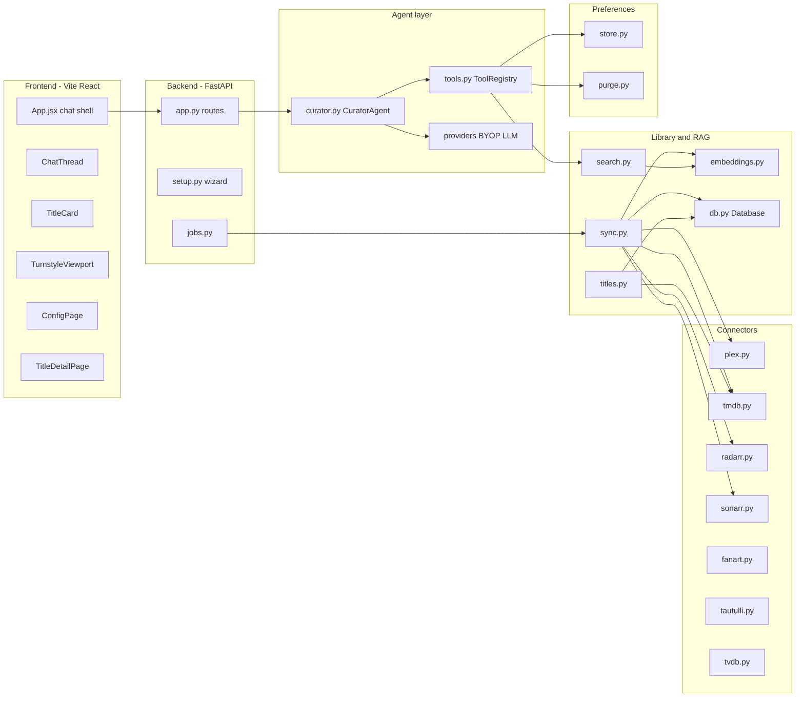
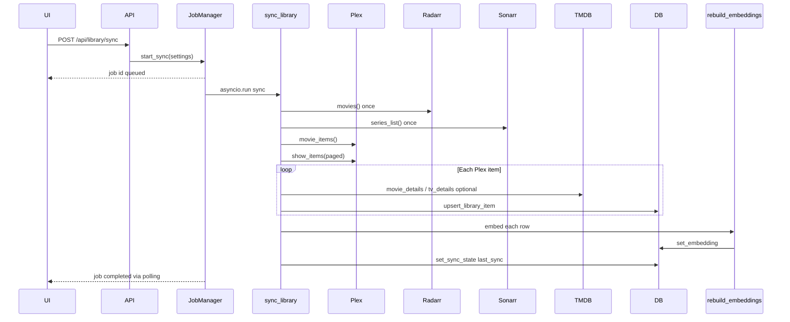
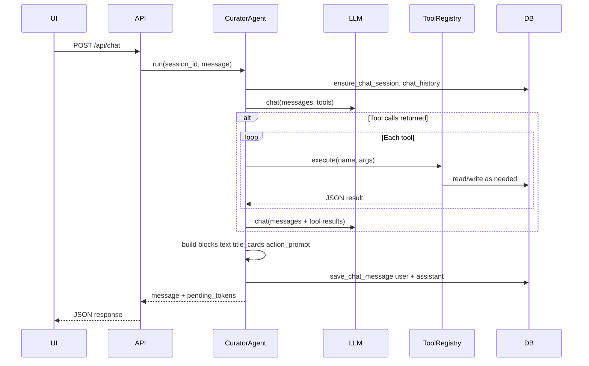
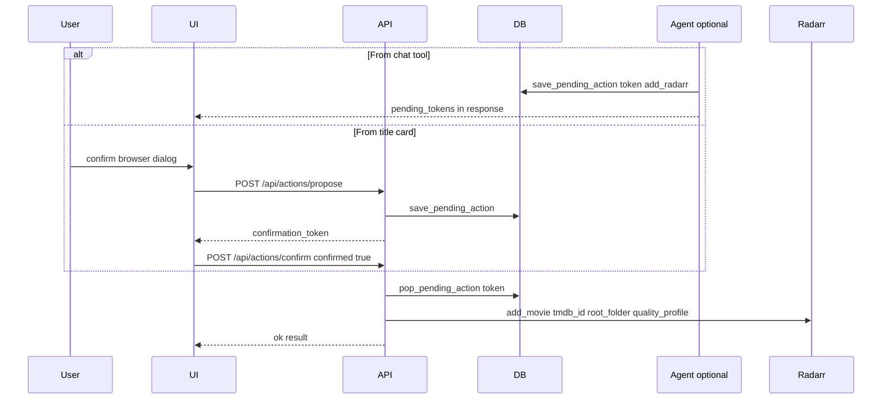
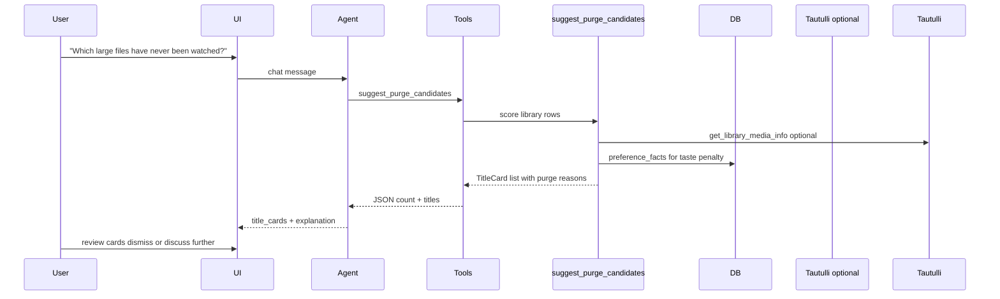
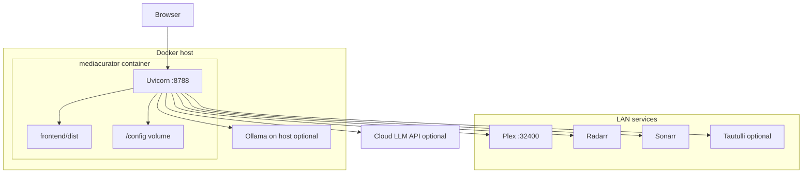

# MediaCurator — Platform Architecture

MediaCurator is an agentic movie and TV collection curator for Plex libraries. It combines a chat-first web UI, a tool-using LLM agent, RAG over your indexed library, and confirmation-gated Radarr/Sonarr actions. It is a **separate product** from [Reclaimspace](https://github.com/romwil/reclaimspace): Reclaimspace reclaims disk space by quarantining duplicate Plex files; MediaCurator helps you discover, add, watch, and purge titles based on taste and usage.

---

## Vision and goals

| Goal | How MediaCurator addresses it |
|------|-------------------------------|
| **Taste-aware curation** | Preference facts, semantic library search, and agent tools grounded in Plex metadata |
| **Chat-first interaction** | Primary UX is conversational; title cards and a turnstyle viewport surface structured results inline |
| **Informed recommendations** | RAG embeddings over indexed library items; TMDB discovery for gaps and hidden gems |
| **Safe automation** | Radarr/Sonarr add and remove actions require explicit user confirmation via short-lived tokens |
| **Self-hosted, BYOP LLM** | OpenAI-compatible, Anthropic, or local Ollama; no vendor lock-in for inference |
| **Homelab friendly** | Single Docker container, SQLite persistence, Unraid template, optional Ollama on the host |

Non-goals for v0.1: multi-user auth, cloud SaaS deployment, automatic file deletion without confirmation, and generic “top 10 on Netflix” recommendations disconnected from your library.

---

## System context

The application runs as a **single process** (Uvicorn + FastAPI). The React frontend is built to static assets and served from the same origin (`/` and `/api/*`). All persistent state lives under `DATA_DIR` (default `/config` in Docker, `./config` locally).

---

## Component architecture

### Frontend (Vite / React)

- **SPA** with client-side routing: `/` (chat), `/config` (settings wizard), `/title/{movie|show}/{id}` (detail).
- **ChatThread** renders assistant message blocks: `text`, `title_cards`, and `action_prompt` (opens turnstyle viewport).
- **TitleCard** shows poster, metadata, add-to-*arr buttons, and “Not interested” (preference signal).
- **TurnstyleViewport** horizontal scroll overlay for expanded result sets.
- Session ID stored in `localStorage` for chat continuity across page loads.

See [WEB_UI.md](WEB_UI.md) and [DESIGN.md](DESIGN.md) for UX details.

### Backend (FastAPI)

- REST + SSE endpoints under `/api/*`; HTML shell routes serve the built frontend.
- **Settings**: merged from `settings.json` and environment variables; secrets masked on read (`*_set` flags).
- **JobManager**: background thread runs library sync; exposes job list and progress via `/api/jobs`.
- **SyncScheduler**: daemon thread checks `library_sync_interval_hours` and triggers sync when stale.

### Agent layer

- **CuratorAgent** orchestrates LLM chat with tool definitions (`TOOL_DEFINITIONS`).
- Supports OpenAI-compatible and Anthropic response shapes; extracts tool calls and runs a second completion after tool results.
- **Fallback mode** (no LLM API key and provider not `ollama`): keyword heuristics invoke tools directly without full conversational reasoning.
- **ToolRegistry** executes tools, accumulates `TitleCard` results, and records pending confirmation tokens.

### Library and RAG

- **sync_library**: Plex → SQLite upsert, TMDB/Fanart enrichment, Radarr/Sonarr queue flags, embedding rebuild.
- **search_library**: query embedding → cosine similarity over stored vectors, keyword fallback.
- **get_title_detail**: merges library row with live TMDB metadata and optional purge scoring.

### Connectors

Thin HTTP clients wrapping Plex XML, TMDB JSON, *arr REST, Fanart, Tautulli, and TVDB v4. Shared helpers live in `connectors/http.py` (including Plex GUID parsing).

### Preferences

- Explicit and implicit signals stored in `preference_facts`.
- Injected into the agent system prompt via `preference_context()`.
- **Purge scoring** combines file size, play count, staleness, and taste penalty from preferences.

---

## Data flows

### Library sync

**Notes:**

- Radarr and Sonarr full lists are fetched **once per sync** and cached in memory as TMDB/TVDB ID sets for `in_radarr` / `in_sonarr` flags.
- TV shows are fetched with configurable page size (`tv_page_size`, default 500) to handle large libraries.
- TMDB enrichment runs **per item during sync** (not batched); this is CPU/network-bound on large libraries.
- A **SyncScheduler** can auto-trigger sync when `last_sync` is older than `library_sync_interval_hours`.

### Chat / agent turn

Streaming variant (`GET /api/chat/stream`): runs the full agent turn first, then emits simulated text deltas and a `complete` event. **Future:** true token streaming from the LLM provider.

### Add-to-Radarr confirmation

Sonarr flow is identical with `tvdb_id` and `add_series`. Tokens expire after **600 seconds** (10 minutes).

### Purge workflow

Purge suggestions are **advisory only** in v0.1. The `remove_from_arr` agent tool exists with confirmation gating but is not exposed as a one-click UI action on title cards. **Future:** guided purge flow with Radarr/Sonarr remove confirmation from the detail page.

---

## Technology stack and rationale

| Layer | Choice | Rationale |
|-------|--------|-----------|
| **Runtime** | Python 3.10+ | Async-friendly, strong ecosystem for HTTP and ML-adjacent work |
| **Web framework** | FastAPI | Typed routes, OpenAPI-ready, async SSE support |
| **Frontend** | Vite + React | Fast dev/build, simple SPA without SSR complexity for a homelab app |
| **Database** | SQLite | Zero-ops persistence, single-file backup with `/config` volume |
| **HTTP client** | httpx (LLM), urllib (connectors) | Minimal deps; sync connectors keep sync job simple |
| **Vectors** | NumPy + JSON blobs in SQLite | No separate vector DB; adequate for typical home libraries (low thousands of titles) |
| **Container** | Multi-stage Docker (Node build + Python slim) | Reproducible Unraid and Mac deployments |

Dependencies are intentionally small: `httpx`, `numpy`, and optional `fastapi` / `uvicorn` / `pydantic` / `sse-starlette` for the web extra.

---

## Deployment architecture

### Docker Compose

- Image built from repo `Dockerfile`; port **8788** mapped via `HOST_PORT`.
- Config volume: `${CONFIG_PATH:-./config}:/config` holds `settings.json` and `mediacurator.db`.
- Environment variables seed first-run settings (see [CONFIGURATION.md](CONFIGURATION.md)).

### Unraid

- Community Applications template (`templates/mediacurator.xml`) or manual container.
- Map `/mnt/user/appdata/mediacurator/config` → `/config`.
- Ollama often runs on the Unraid host; set `LLM_BASE_URL=http://host.docker.internal:11434/v1` or the host LAN IP.

### Mac development

- **Docker Desktop** or **Colima** + `docker-compose` plugin for containerized runs.
- Native dev: Python venv, `pip install -e ".[web]"`, `npm run build` in `frontend/`, `DATA_DIR=./config python -m mediacurator.web`.

See [DOCKER.md](DOCKER.md) for Colima plugin setup and troubleshooting.

---

## Security model

| Topic | Behavior |
|-------|----------|
| **Authentication** | None by default. Intended for trusted LAN or behind an authenticated reverse proxy. |
| **Destructive actions** | All Radarr/Sonarr writes go through `pending_actions` tokens; user must confirm (browser dialog + API confirm, or agent-returned token flow). |
| **Secrets** | API keys stored in `settings.json` on the config volume; masked in GET responses; env vars override file values. |
| **Token TTL** | Confirmation tokens expire after 10 minutes. |
| **Network trust** | Connectors use server-side API keys to Plex, *arr, TMDB, etc.; the browser never receives those secrets after save. |

**Future:** optional API key or OAuth for multi-user or internet-exposed installs.

---

## Scalability and performance

| Area | Current approach | Notes |
|------|------------------|-------|
| **Sonarr/Radarr during sync** | Full list fetched once, ID sets in memory | Avoids N+1 API calls per library item |
| **TMDB during sync** | Per-item detail fetch when `tmdb_id` present | Can be slow on large libraries; runs in background job |
| **TV library fetch** | Plex paged fetch (`tv_page_size`) | Progress reported to job status |
| **Embeddings** | Full rebuild after each sync | **Future:** incremental embedding for changed rows only |
| **Semantic search** | Load all vectors, cosine similarity in Python | Fine for ~1–5k items; **Future:** sqlite-vec or approximate index if libraries grow |
| **Embedding fallback** | SHA256 hash-based 384-dim vectors | Works without API key; quality lower than model embeddings |
| **Chat history** | Last 20 messages loaded for LLM context | Text blocks only; cards not re-sent verbatim |

---

## Extension points

| Extension | Status | Integration surface |
|-----------|--------|---------------------|
| **BYOP LLM** | Implemented | `LLM_PROVIDER`, `LLM_BASE_URL`, `LLM_MODEL`, `get_chat_provider()` |
| **Custom embeddings** | Implemented | `LLM_EMBEDDING_MODEL`, `LLM_EMBEDDING_BASE_URL`, `get_embedding_provider()` |
| **New agent tools** | Add to `TOOL_DEFINITIONS` + `ToolRegistry._tool_*` | Automatically available to LLM when tools enabled |
| **Trakt taste import** | **Future** | Would feed `preference_facts` and watch history |
| **TVDB enrichment** | Partial | Client and settings exist; not wired into sync pipeline yet |
| **True SSE LLM streaming** | **Future** | `OpenAICompatibleProvider.stream` exists but agent uses non-streaming path |
| **Webhooks / notifications** | **Future** | Post-sync or post-add hooks |

---

## Related documentation

- [DESIGN.md](DESIGN.md) — product principles, UX, agent tools, API surface
- [DATA_MODEL.md](DATA_MODEL.md) — SQLite schema and Pydantic models
- [CONFIGURATION.md](CONFIGURATION.md) — settings reference
- [ONBOARDING.md](ONBOARDING.md) — first-run flow
- [DOCKER.md](DOCKER.md) — deployment on Mac, Docker, Unraid
