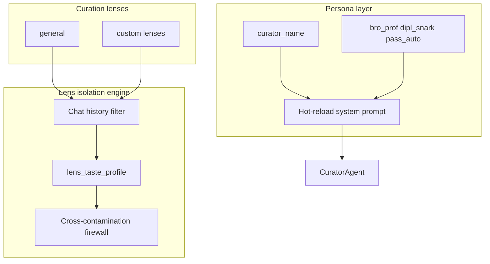
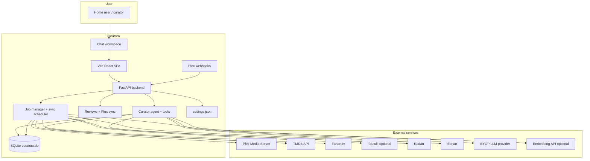
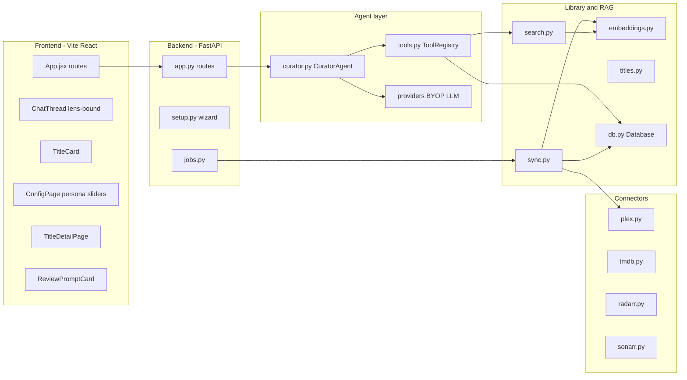
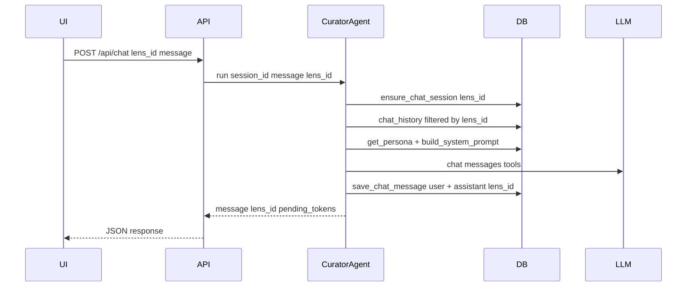
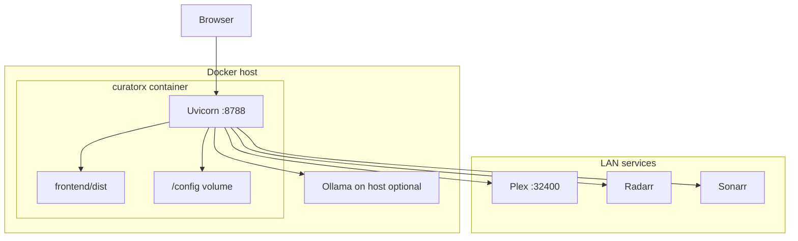

# CuratorX — Platform Architecture

CuratorX is an **intent-aware curation companion** for Plex libraries. It combines a single-workspace chat UI, a tool-using LLM agent, RAG over your indexed library, **curation lens isolation**, **dynamic persona tuning**, personal **reviews** with optional Plex rating sync, **Plex webhooks** for near-completion rating prompts, and confirmation-gated Radarr/Sonarr actions.

It is a **separate product** from [Reclaimspace](https://github.com/romwil/reclaimspace): Reclaimspace reclaims disk space by quarantining duplicate Plex files; CuratorX helps you discover, add, watch, and purge titles based on taste and usage within explicit cognitive boundaries.

---

## Vision and goals

| Goal | How CuratorX addresses it |
|------|---------------------------|
| **Intent-aware curation** | Lenses sandbox taste; persona sliders shape agent behavior |
| **Anti-monolith taste** | `lens_id` on chat, telemetry, and taste profiles prevents context contamination |
| **Chat-first interaction** | Single chat workspace with welcome panel, watchlist, and status dock |
| **Informed recommendations** | RAG embeddings + TMDB discovery grounded in library ownership |
| **Safe automation** | Radarr/Sonarr writes require explicit confirmation tokens |
| **Self-hosted, BYOP LLM** | OpenAI-compatible, Anthropic, or Ollama |
| **Homelab friendly** | Single Docker container, SQLite, Unraid template |

Non-goals for 1.0: cloud SaaS, automatic file deletion without confirmation, generic streaming-service recommendations, OIDC/local password auth. Multi-user auth, Seerr, and Plex collections are **optional** (off by default); see [CONFIGURATION.md](CONFIGURATION.md#feature-flags-optional-off-by-default).

---

## Cognitive architecture

- **Default lens:** `general` — seeded at database init.
- **Active lens:** stored in `curator_system_config.active_lens_id`.
- **Chat isolation:** `chat_messages.lens_id` filters history per lens within a session.
- **Explicit lock:** `lens_taste_profile.explicit_lock` blocks automatic telemetry drift on protected clusters.

See [curatorx_prd.md](curatorx_prd.md) for the full product spec.

---

## System context

The application runs as a **single process** (Uvicorn + FastAPI). The React frontend builds to static assets served from the same origin. Persistent state lives under `DATA_DIR` (default `/config` in Docker).

---

## Component architecture

### Frontend (Vite / React)

- **Single workspace** — chat thread, welcome panel, watchlist sidebar, keyboard shortcuts.
- **Lens switcher** — updates active `lens_id`, theme accents, and chat scope.
- **ChatThread** — renders blocks: `text`, `title_cards`, `action_prompt`, review prompts.
- **ConfigPage** — setup wizard, persona sliders, live service validation.

See [WEB_UI.md](WEB_UI.md) and [DESIGN.md](DESIGN.md).

### Backend (FastAPI)

- REST + SSE under `/api/*`.
- **Lens API** — `/api/lenses`, `/api/lenses/active`.
- **Persona API** — `/api/persona`, `/api/system-config`.
- **Reviews API** — `/api/reviews` with optional Plex rating sync and conflict handling.
- **Webhooks** — `POST /api/webhooks/plex` for near-completion rating prompts (optional shared secret).
- **JobManager** — background library sync with progress polling.
- **CuratorAgent** — accepts `lens_id`; builds persona-aware system prompt; tool list respects feature flags.

### Library and RAG

Unchanged core: Plex sync → SQLite upsert → TMDB enrichment → embedding rebuild → semantic search.

### Connectors

Thin HTTP clients for Plex, TMDB, *arr, Fanart, Tautulli, TVDB.

---

## Data flows

### Chat / agent turn (lens-scoped)

### Library sync

`POST /api/library/sync` → JobManager → Plex/Radarr/Sonarr/TMDB → embeddings. Jobs persist under `DATA_DIR/jobs_state.json`; inspect `GET /api/jobs` for phase / percent / message. Interrupted runs after restart are marked failed with a recovery message.

### Add-to-Radarr confirmation

Two-phase: propose token → user confirm → execute. TTL 600 seconds.

---

## Technology stack

| Layer | Choice | Rationale |
|-------|--------|-----------|
| Runtime | Python 3.10+ | Async-friendly, homelab standard |
| Web | FastAPI + Uvicorn | Typed routes, SSE |
| Frontend | Vite + React | Single-workspace SPA without SSR complexity |
| Database | SQLite | Zero-ops; single-file backup |
| Vectors | NumPy + JSON in SQLite | Adequate for home libraries |
| Container | Multi-stage Docker | Node build + Python slim |

---

## Deployment architecture

See [DOCKER.md](DOCKER.md) for Mac Colima, Unraid, and Compose details.

---

## Security model

| Topic | Behavior |
|-------|----------|
| Authentication | **None by default** — single implicit owner; use trusted LAN or reverse proxy. Optional multi-user auth (`features.multi_user_enabled`) adds **Plex login** (OIDC/local not shipped in 1.0) |
| Feature gates | `GET /api/features` exposes enabled flags; auth UI, Seerr, and Plex collection tools stay hidden until opted in |
| Webhooks | Optional `webhook_secret` / `CURATORX_WEBHOOK_SECRET`; validates `X-CuratorX-Webhook-Secret` when set |
| Destructive actions | Confirmation tokens for all *arr writes; owner role gates apply when multi-user is on |
| Secrets | Masked on API read; env overrides file |
| Lens isolation | Chat and taste scoped by `lens_id`; no cross-lens history leakage in API |
| Message feedback | Helpful/not-helpful on assistant replies trains preferences; scoped per user when multi-user is on |

---

## Extension points (1.0+)

| Extension | Status |
|-----------|--------|
| Curation lenses | **Implemented** — CRUD, active lens, chat filter |
| Persona sliders / presets | **Implemented** — DB-backed, hot-reload prompt |
| Single chat workspace | **Implemented** — see [WEB_UI.md](WEB_UI.md) |
| Durable sync jobs | **Implemented** — `jobs_state.json` + restart recovery |
| Reviews + Plex sync | **Implemented** — personal stars, conflict detection, webhook prompts |
| Plex webhooks | **Implemented** — near-completion rating queue; optional auth secret |
| Agent blueprints | Schema present; scheduler wiring **Future** |
| Interaction telemetry | Schema present; ingestion **Future** |
| True LLM SSE streaming | **Future** |
| OIDC / local auth | **Future** (not in 1.0) |

---

## Related documentation

- [DESIGN.md](DESIGN.md) — UX principles, agent tools
- [DATA_MODEL.md](DATA_MODEL.md) — SQLite and PRD tables
- [wiki/Home.md](wiki/Home.md) — operator wiki
- [CONFIGURATION.md](CONFIGURATION.md) — settings reference
- [FAQ.md](FAQ.md) — common questions