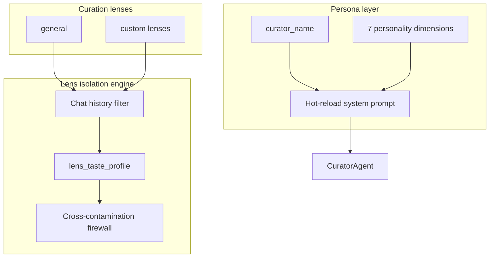
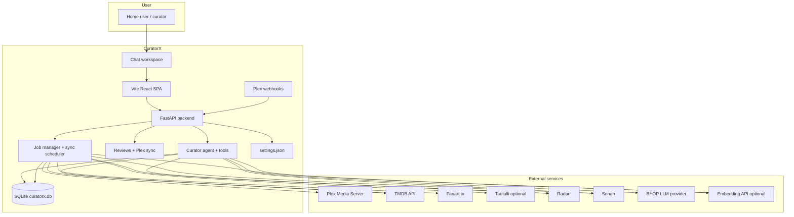
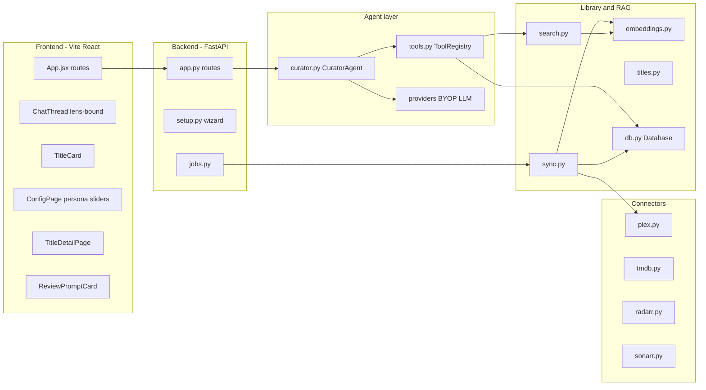
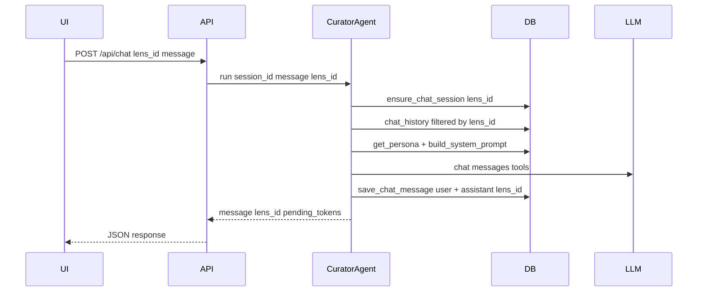
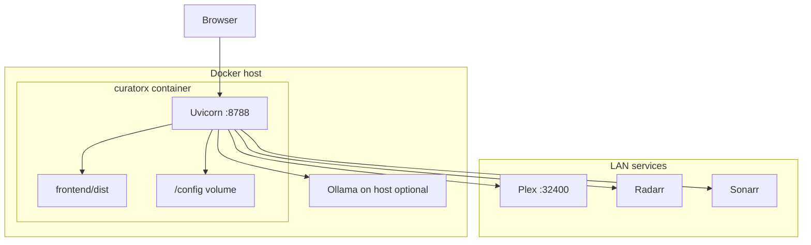

# CuratorX — Platform Architecture

CuratorX is an **intent-aware curation companion** for Plex libraries. It combines a single-workspace chat UI, a tool-using LLM agent, RAG over your indexed library, **curation lens isolation**, **dynamic persona tuning**, personal **reviews** with optional Plex rating sync, **Plex webhooks** for near-completion rating prompts, and confirmation-gated Radarr/Sonarr actions.

It is a **separate product** from [Reclaimspace](https://github.com/romwil/reclaimspace): Reclaimspace reclaims disk space by quarantining duplicate Plex files; CuratorX helps you discover, add, watch, and purge titles based on taste and usage within explicit cognitive boundaries.

---

## Vision and goals

| Goal | How CuratorX addresses it |
|------|---------------------------|
| **Intent-aware curation** | Lenses sandbox taste; persona sliders shape agent behavior |
| **Anti-monolith taste** | `lens_id` on chat, telemetry, and taste profiles prevents context contamination |
| **Chat-first interaction** | Single chat workspace with welcome panel, watchlist, and status dock |
| **Informed recommendations** | RAG embeddings + TMDB discovery grounded in library ownership |
| **Safe automation** | Radarr/Sonarr writes require explicit confirmation tokens |
| **Self-hosted, BYOP LLM** | OpenAI-compatible, Anthropic, or Ollama |
| **Homelab friendly** | Single Docker container, SQLite, Unraid template |

Non-goals: cloud SaaS, automatic file deletion without confirmation, generic streaming-service recommendations. Multi-user auth (**Sign in with Plex** PIN, optional **local password**, optional **OIDC**), Seerr, and Plex collections are **optional** (off by default); see [CONFIGURATION.md](CONFIGURATION.md#feature-flags-optional-off-by-default).

### Design thesis — MCP over local data

CuratorX is a production-quality example of a **Model Context Protocol interface** against structured and unstructured local data. The LLM never sees raw credentials or bulk exports; it issues targeted tool calls against a pre-indexed SQLite store that returns exactly the slice needed for each conversational turn.

> "The LLM gets to act like a natural language surgeon on a highly optimized, predictable local dataset. It's incredibly fast, it's cheap, and it keeps your Plex token and personal collection server info locked down."

This pattern — privacy-first MCP bridging a conversational AI to a rich personal dataset — generalizes beyond media curation. CuratorX demonstrates the approach end-to-end: dual trust-plane keys, confirm-gated mutations, and field-level redaction per mode. See [MCP.md](MCP.md) for the protocol surface.

---

## Cognitive architecture



- **Default lens:** `general` — seeded at database init.
- **Active lens:** stored in `curator_system_config.active_lens_id`.
- **Chat isolation:** `chat_messages.lens_id` filters history per lens within a session.
- **Explicit lock:** `lens_taste_profile.explicit_lock` blocks automatic telemetry drift on protected clusters.

See [curatorx_prd.md](curatorx_prd.md) for the full product spec.

---

## System context



The application runs as a **single process** (Uvicorn + FastAPI). The React frontend builds to static assets served from the same origin. Persistent state lives under `DATA_DIR` (default `/config` in Docker).

---

## Component architecture



### Frontend (Vite / React)

- **Single workspace** — chat thread, welcome panel, watchlist sidebar, keyboard shortcuts.
- **Explore hub** — `/explore` cinema browse (Recently Added + feed rails); Plot Lab section reserved for motif/neighbor discovery.
- **Title detail** — `/title/{movie|show}/{id}` with backdrop hero, neighbors carousel, trailer modal.
- **Dual theme** — Lights Up (gallery paper) / Lights Down (cinema chamber) via `html[data-theme]`.
- **ChatThread** — blocks (`text`, `title_cards`, `action_prompt`, review prompts) plus circular **AgentAvatar**.
- **ConfigPage** — setup wizard, persona sliders, live service validation.

See [WEB_UI.md](WEB_UI.md) and [DESIGN.md](DESIGN.md).

### Backend (FastAPI)

- REST + SSE under `/api/*`.
- **Lens API** — `/api/lenses`, `/api/lenses/active`.
- **Persona API** — `/api/persona`, `/api/system-config`.
- **Reviews API** — `/api/reviews` with optional Plex rating sync and conflict handling.
- **Explore feeds** — `/api/library/feeds/*`, `/api/library/neighbors/{item_id}`, `/api/library/motifs`.
- **Webhooks** — `POST /api/webhooks/plex` for near-completion rating prompts (optional shared secret).
- **JobManager** — background library sync with progress polling.
- **CuratorAgent** — accepts `lens_id`; builds persona-aware system prompt; tool list respects feature flags.

### Library and RAG

Plex sync → SQLite upsert → TMDB enrichment (sync + idle trickle) → layered plot text → embeddings → materialized neighbors → title_relations graph → semantic / facet / feed queries. Structured credits (`people` / `credits`) dual-write alongside legacy JSON cast/directors arrays.

### Connectors

Thin HTTP clients for Plex, TMDB, *arr, Fanart, Tautulli, TVDB.

---

## Data flows

### Chat / agent turn (lens-scoped)



### Library sync

`POST /api/library/sync` → JobManager → Plex/Radarr/Sonarr/TMDB → embeddings. Jobs persist under `DATA_DIR/jobs_state.json`; inspect `GET /api/jobs` for phase / percent / message. Interrupted runs after restart are marked failed with a recovery message; a new sync resumes from the last valid phase checkpoint (≤72h).

### Add-to-Radarr confirmation

Two-phase: propose token → user confirm → execute. TTL 600 seconds.

---

## Technology stack

| Layer | Choice | Rationale |
|-------|--------|-----------|
| Runtime | Python 3.10+ | Async-friendly, homelab standard |
| Web | FastAPI + Uvicorn | Typed routes, SSE |
| Frontend | Vite + React | Single-workspace SPA without SSR complexity |
| Database | SQLite | Zero-ops; single-file backup |
| Vectors | NumPy + JSON in SQLite | Adequate for home libraries |
| Container | Multi-stage Docker | Node build + Python slim |

---

## SQLite concurrency model

CuratorX runs as a single process with multiple concurrent writers: the FastAPI request handlers (asyncio tasks on the main thread), the idle scheduler (asyncio background task), and telemetry ingestion (daemon threads). SQLite's default journal mode (`DELETE`) only allows one reader *or* one writer at a time, which would cause `database is locked` errors under concurrent access. Three mechanisms work together to prevent this.

### WAL mode (write-ahead logging)

Every connection sets `PRAGMA journal_mode=WAL` on open (`db.py._open_connection`). WAL mode is persistent — once set on a database file it survives restarts — but we set it per-connection defensively. With WAL:

- **Readers never block writers.** A chat-turn SELECT runs concurrently with a scheduler INSERT without contention.
- **Writers never block readers.** An active library sync doesn't freeze the web UI.
- **Only one writer** can commit at a time (SQLite fundamental), but the WAL makes the write-lock window very short compared to DELETE journal mode.

### Busy timeout (30 seconds)

Every connection sets `PRAGMA busy_timeout=30000`. When a writer encounters a locked database, SQLite retries internally for up to 30 seconds before raising `OperationalError`. This absorbs brief write overlaps (e.g. a telemetry insert landing at the same moment as a scheduler commit) without application-level retry logic. The Python-level `timeout` parameter on `sqlite3.connect()` is set to the same value for consistency.

On top of busy_timeout, the `run_with_db_lock_retry` utility adds application-level exponential backoff for critical multi-row writes (batch upserts, embedding stores) — up to 6 retries with jittered delays. This two-layer approach handles both brief contention (SQLite-level) and sustained bursts (application-level).

### Synchronous = NORMAL

With WAL, `PRAGMA synchronous=NORMAL` avoids an fsync on every commit while still guaranteeing durability against application crashes. Data loss is only possible on an OS crash or power failure *during* a commit — an acceptable tradeoff for a homelab media curator running on Unraid/NAS hardware where fsync can be especially slow over network-attached storage.

### Why not a single-writer queue?

A common architectural pattern for SQLite is to funnel all writes through an in-memory asyncio.Queue with a dedicated worker. CuratorX intentionally avoids this because:

1. **The scheduler already runs tasks sequentially** — only one task executes at a time, eliminating writer contention among background jobs.
2. **Telemetry writes are tiny single-row inserts** — they hold the write lock for microseconds and the busy_timeout absorbs any overlap.
3. **Request-handler writes are infrequent** — most chat turns are read-heavy (RAG search, history lookup); writes are limited to saving the assistant's reply and occasional preference updates.
4. **A queue adds complexity** — error propagation, backpressure, shutdown ordering, and testing overhead that isn't justified at homelab scale.

If write contention ever becomes measurable (observable via the `SQLite locked` warning logs), the migration path is straightforward: add an asyncio.Queue in `Database` and route writes through it. The current `connect()` context manager makes this a single-point refactor.

### Trickle ingestion for embeddings

The `semantic_embeddings` scheduler task is the heaviest writer. To avoid pegging CPU and holding the write lock during large backfills (e.g. 500 new movies after an initial sync), it uses trickle ingestion:

- **Per-cycle cap** (`MAX_ITEMS_PER_CYCLE = 50`): embeds at most 50 items per scheduler invocation, then exits with `cycle_limit` status. Remaining items are picked up on the next idle cycle.
- **Batched API calls** (`BATCH_SIZE = 10`): items are sent to the embedding API in batches of 10, with an `asyncio.sleep(0)` yield between batches to allow other coroutines to run.
- **Cooperative interruption**: `should_stop()` is checked between batches, so if a chat request arrives the task yields immediately.

---

## Deployment architecture



See [DOCKER.md](DOCKER.md) for Mac Colima, Unraid, and Compose details.

---

## Agent tools vs. background scheduler

CuratorX has two execution paths that operate on the same data. Understanding the boundary prevents duplication and clarifies where new functionality belongs.

```
User Chat ──► CuratorAgent ──► Tools ──► DB ◄── Scheduler Tasks ◄── IdleScheduler
              (sync, <2s)                         (async, batch)
```

### Agent tools — synchronous, user-triggered

Defined in `curatorx/agent/tools.py`. Executed within a single chat turn when the user asks a question or requests an action. Tools call into `db.py` and external APIs (TMDB, Radarr, Sonarr, Plex). Results flow back to the LLM for response generation.

**Characteristics:** latency-sensitive (<2 seconds), scoped to one user query, read-heavy with occasional confirmed writes.

### Background scheduler — asynchronous, system-triggered

Defined in `curatorx/scheduler/engine.py` with individual tasks in `curatorx/scheduler/tasks/`. The `IdleScheduler` runs during idle periods (no chat activity for N minutes) and executes maintenance and enrichment tasks sequentially to avoid SQLite write contention.

**Characteristics:** batch-oriented, minutes-long, produces data that agent tools later consume. Each task receives a `should_stop` callback for cooperative interruption when chat activity resumes.

### The boundary rule

| If it…                                            | It belongs in…         |
|---------------------------------------------------|------------------------|
| Takes <2s and answers a user question              | Agent tool             |
| Is batch processing, enrichment, or maintenance    | Scheduler task         |
| Takes >30s or touches every row in a table         | Scheduler task         |
| Reads pre-computed results for a chat response     | Agent tool (consumer)  |

Some features span both sides. The scheduler pre-computes; the agent tool (or Explore API) reads the results:

| Scheduler produces | Consumers |
|--------------------|-----------|
| `semantic_embeddings` | `search_library`, semantic `query_library` |
| `metadata_enrichment` | release dates, TMDB overview/tagline, collection ids, structured credits |
| `plot_neighbors` → `item_neighbors` | `find_similar_titles`, Title Detail “More Like This”, `/api/library/neighbors/{id}` |
| `summary_motifs` / `llm_theme_tagging` → `library_facets` | `get_facet_catalog` (`motif` / `theme`), Explore Plot Lab |
| `title_relations_refresh` → `title_relations` | `list_relations`, `walk_relations` |
| `llm_logline_enrichment` | layered embedding text (optional; never invents plot) |
| `anniversary_scanner` | `get_todays_anniversaries`, On This Day feed fallback |
| `recommendation_warmup` | agent recommendation caches |
| `taste_refresh` | persona/taste personalization |
| `health_metrics` | `/api/library/health`, owner dashboard |

### Metadata trickle (sync vs idle)

**Sync** (user/API/schedule-triggered) must stay responsive: Plex scan, durable phase checkpoints, bounded TMDB enrichment workers, facet/FTS rebuild. It records honest provenance fields (`added_at` from Plex, ISO `release_date` / `first_air_date` from TMDB when present — **never invented from year alone**).

**Idle trickle** fills gaps without pegging the homelab box:

1. `metadata_enrichment` — missing dates, overviews, taglines, collection ids, credits
2. `semantic_embeddings` — capped batches (see [Trickle ingestion](#trickle-ingestion-for-embeddings))
3. `plot_neighbors` — materialize top-K cosine (+ surprise) into `item_neighbors`
4. `summary_motifs` / optional `llm_theme_tagging` / `llm_logline_enrichment`
5. `title_relations_refresh` — collection + neighbor + shared-crew edges

Agent tools and Explore feeds **read caches**; they do not recompute embeddings or graphs per chat turn.

### Materialized similarity & relations

Homelab SQLite cannot afford full pairwise cosine on every “more like this” click. Pattern:

1. Store vectors in `embeddings` (with `embedding_model` for rebuild hygiene).
2. Idle task writes top neighbors to `item_neighbors` (`score`, `surprise_score`).
3. Optional graph mirror in `title_relations` (`collection`, `neighbor`, `shared_crew`, optional `llm_theme`).
4. UI/API/agent tools SELECT from those tables.

Empty neighbor/relation responses are **honest** — they mean the idle cache has not been built yet, not that the library has no similar titles.

### Explore feed APIs

| Endpoint | Source | Honesty rule |
|----------|--------|--------------|
| `GET /api/library/feeds/recently-added` | `library_items.added_at` | Empty + note if sync never recorded `added_at` |
| `GET /api/library/feeds/recent-releases` | `release_date` / `first_air_date` | Empty + note if no enriched dates (no year faking) |
| `GET /api/library/feeds/on-this-day` | calendar month-day match, else milestone-year fallback | `mode` field discloses which path ran |
| `GET /api/library/neighbors/{item_id}` | `item_neighbors` | Empty until `plot_neighbors` ran |
| `GET /api/library/motifs` | `library_facets` where `facet_type='motif'` | Empty until motif task ran |

### Watchdog and circuit breaker

Each scheduler task runs with a configurable timeout (default 5 minutes). A per-task failure counter tracks consecutive failures; after 3 consecutive failures the task is **quarantined** — skipped on subsequent cycles until the cooldown period (default 1 hour) elapses or an admin clears it via `POST /api/admin/scheduled-tasks/{name}/reset`. Quarantine state is in-memory and resets on restart.

---

## Security model

| Topic | Behavior |
|-------|----------|
| Authentication | **None by default** — single implicit owner on trusted LAN. With `features.multi_user_enabled`, login via **Plex PIN**, optional **local password**, and/or **OIDC** (login page shows configured `auth_methods`); session cookies + middleware protect `/api/*` (allowlist: health/features/auth/webhooks) |
| Roles | Owner-only: settings, setup tests, library sync mutate, persona/lens writes. Guests cannot request media / *arr writes |
| Partitioning | Chat, pending actions, watchlist, reviews, preferences scoped by `user_id` when multi-user is on (shared library remains household-wide) |
| Feature gates | `GET /api/features` exposes enabled flags; auth UI, Seerr, and Plex collection tools stay hidden until opted in |
| Webhooks | Require non-empty `webhook_secret` / `CURATORX_WEBHOOK_SECRET` + matching `X-CuratorX-Webhook-Secret` |
| Destructive actions | Confirmation tokens for all *arr / Seerr writes; tokens bound to user when multi-user is on |
| Session secret | Auto-persisted under DATA_DIR; `CURATORX_SESSION_SECRET` preferred; public default refused for multi-user |
| Secrets | Masked on API read; env overrides file |
| Lens isolation | Chat and taste scoped by `lens_id`; no cross-lens history leakage in API |
| MCP | Optional stdio + HTTP `/mcp`; dual keys (`CURATORX_MCP_API_KEY` privacy / `CURATORX_MCP_FULL_API_KEY` full) |

See [SECURITY.md](SECURITY.md) and [wiki/Multi-User.md](wiki/Multi-User.md) for the full partitioning matrix.

---

## Extension points (1.8+)

| Extension | Status |
|-----------|--------|
| Curation lenses | **Implemented** — CRUD, active lens, chat filter |
| Persona templates / sliders | **Implemented** — 7 dimensions, per-conversation selector, hot-reload prompt |
| Single chat workspace | **Implemented** — see [WEB_UI.md](WEB_UI.md) and [DESIGN.md](DESIGN.md) |
| Dual theme + icon chrome | **Implemented** — Lights Up / Lights Down / Match system; Material icon top-bar |
| Explore hub | **Implemented** — `/explore` feed rails, Pulse strip, Plot Lab motifs/neighbors |
| Title detail + neighbors | **Implemented** — hero detail, trailer, “More Like This” from `item_neighbors` |
| Metadata enrichment + credits | **Implemented** — sync + idle trickle; `people` / `credits` tables |
| Layered plot text | **Implemented** — Plex summary + TMDB overview/tagline + optional LLM logline |
| Materialized neighbors | **Implemented** — `item_neighbors` via `plot_neighbors` idle task |
| Title relations graph | **Implemented** — collection / neighbor / shared_crew (+ optional llm_theme) |
| Motif / theme facets | **Implemented** — `summary_motifs`, optional `llm_theme_tagging` |
| Owner dashboard | **Implemented** — `/admin/dashboard` composition, health, purge, taste |
| Idle task scheduler | **Implemented** — embeddings, enrichment, neighbors, relations, motifs, taste, health, …; circuit breaker |
| Durable sync jobs | **Implemented** — `jobs_state.json` + restart recovery |
| Reviews + Plex sync | **Implemented** — personal stars, conflict detection, webhook prompts |
| Plex webhooks | **Implemented** — near-completion rating queue; optional auth secret |
| Interaction telemetry | **Implemented** — non-blocking ingest + admin summary/events APIs |
| True LLM SSE streaming | **Implemented** — token/tool_call/done/error events |
| OIDC / local auth | **Implemented** — opt-in alongside Plex PIN; see [CONFIGURATION.md](CONFIGURATION.md) |
| Household recommendations | **Implemented** — peer recommend + unread inbox |
| Non-root Docker | **Implemented** — `curatorx` UID/GID 1000 + entrypoint chown |
| Agent blueprints | Schema present; richer scheduler wiring **Future** |
| Plex Lists publish | **Future** (pending stable Plex Discover API) |
| sqlite-vec ANN prefilter | **Future** — `item_neighbors` remains the read cache either way |

---

## Related documentation

- [DESIGN.md](DESIGN.md) — UX principles, agent tools
- [DATA_MODEL.md](DATA_MODEL.md) — SQLite and PRD tables
- [wiki/Home.md](wiki/Home.md) — operator wiki
- [CONFIGURATION.md](CONFIGURATION.md) — settings reference
- [FAQ.md](FAQ.md) — common questions