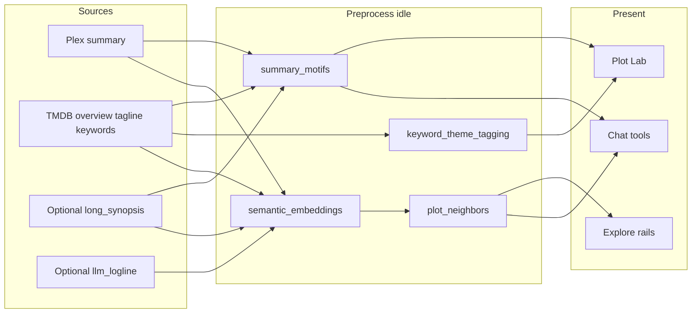

# Curator knowledge — how CuratorX understands your library

CuratorX does not “remember” every plot the way a streaming catalog’s marketing copy implies. It builds **stacked knowledge dimensions** from free local/Plex/TMDB data first, then optional LLM layers, then presents that knowledge in Chat, Explore, and Plot Lab.

This guide explains **why** motif walls can feel sparse, **what** each knowledge layer is, **how** idle tasks fill them, and **what** owners should expect over time.

In-app entry point: `/help` ([HELP.md](HELP.md)) · related: [ARCHITECTURE.md](ARCHITECTURE.md) · [DATA_MODEL.md](DATA_MODEL.md) · [WEB_UI.md](WEB_UI.md)

---

## Why short blurbs make Plot Lab walls sparse

Most titles arrive with a **Plex summary** and, after enrichment, a **TMDB overview** — typically ~200–300 characters. That is enough for a poster card, and not enough for dense motif intersections.

### Case study: Kill Bill · bride ∩ coma

*Kill Bill: Vol. 1* plot text literally mentions **the Bride** and a **coma**. Yet Plot Lab can still fail a `bride` + `coma` intersection. Current motif extraction:

1. Motifs are normalized **unigrams** and content-word **bigrams** from the layered summary, overview, tagline, long synopsis, and optional logline. Grammar fragments such as `and chloe` or `its power` are rejected, while useful compounds such as `wicked wonderland` remain.
2. Document-frequency filtering keeps uncommon-but-shared terms (`df ≥ 2`, not ultra-common).
3. Each title keeps at most **18** motifs (`MAX_MOTIFS_PER_ITEM`), preferring rarer candidates and contentful phrases — so “bride” can still lose the slot race to other rare words.
4. Possessives are normalized (`bride's` → `bride`), so Vol. 2 can store the same token.
5. Plot Lab’s motif wall is an **AND** over those facet rows. Missing one chip → empty wall, even when the library “knows” the film in free text or TMDB keywords (`revenge`, `martial arts`, …).

**Takeaway:** Sparse walls are often a **representation / intersection** problem, not an empty library. Keywords and raw plot text are richer than the motif chip set today.

### Roadmap (in flight)

Phase work landing in parallel aims to unlock bride∩coma-style discovery **without** burning LLM tokens:

| Phase | Intent |
|-------|--------|
| **A** | Better motif extraction (normalize possessives, bigrams, retain keyword-aligned tokens) + Plot Lab multi-signal AND (motifs ∪ keywords ∪ live plot-text match) with Why? citing the matching layer |
| **B** | Durable scheduler run history, measured throughput in Admin, auto-tune batch/interval from real runs, neighbor backlog catch-up |
| **C** | Optional long synopsis sources + local keyword→theme mapping; LLM loglines/themes stay last-resort |
| **D** | Coverage UI, title “Plot knowledge” panel, chat tools that prefer structured layers before semantic search |

Until those land, treat empty intersections as **honest**: the motif cache or the 8-slot budget did not retain every salient word.

---

## Knowledge dimensions

Treat curator knowledge as a stack, not one chip wall:

| # | Dimension | What it is | Typical source | Status |
|---|-----------|------------|----------------|--------|
| 1 | **Identity** | Title, year, media type, Plex/TMDB/IMDB ids | Plex sync | Done |
| 2 | **Credits / place** | People, jobs, country, language | TMDB credits + sync | Done |
| 3 | **Catalog tags** | Genres, TMDB keywords | Sync + `metadata_enrichment` | Mostly done; underused in Plot Lab today |
| 4 | **Plot text layers** | summary → overview → tagline → optional long synopsis → rare LLM logline | Plex / TMDB / optional idle | Layered fields exist; long synopsis optional (Wikipedia/OMDb) |
| 5 | **Lexical motifs** | Searchable plot tokens in `library_facets` (`facet_type='motif'`) | Idle `summary_motifs` | Improved (Phase A); hybrid Plot Lab AND mitigates sparsity |
| 6 | **Tropes / themes** | Controlled vocab (`facet_type='theme'`) | Idle `keyword_theme_tagging` (local map); `llm_theme_tagging` stub reserved | Offline from keywords |
| 7 | **Similarity graph** | Embeddings + `item_neighbors` + `title_relations` | Idle embed / neighbors / relations | Embeddings often full; neighbor edges can lag |
| 8 | **Taste / ops** | Lenses, reviews, purge, watchlist, gaps | User + other idle tasks | Separate from plot depth |

**Principle:** Prefer free/structured sources and local NLP before LLM. LLM stays a thin optional layer for hard gaps. Provenance rules stay sacred — CuratorX must not invent plot ([DATA_MODEL.md](DATA_MODEL.md#provenance-rules-dates--plot-text)).

---

## How data is sourced, stored, preprocessed, presented

### Sourced

| Layer | Where it comes from |
|-------|---------------------|
| Plex `summary`, play state, `added_at` | Library sync |
| TMDB `tmdb_overview`, `tagline`, keywords, dates, credits | Sync enrichment + idle `metadata_enrichment` |
| `llm_logline` | Optional idle `llm_logline_enrichment` when a provider is configured — **never invented** if the task skips |
| `long_synopsis` / `synopsis_source` | Idle `long_synopsis_enrichment` — default source **Wikipedia** (free, no key, deeper plot without LLM); set `long_synopsis_source=off` to disable — never overwrites Plex/TMDB |
| Motif facets | Idle `summary_motifs` (local NLP over layered plot text) |
| Theme facets | Idle `keyword_theme_tagging` (local keyword→theme map; no LLM) |
| Embeddings + neighbors | Idle `semantic_embeddings` then `plot_neighbors` |

### Stored

Primary store: `{DATA_DIR}/curatorx.db` (SQLite). Key tables:

- `library_items` — identity + plot text columns + keyword JSON
- `library_facets` — genres/people facets from sync; `motif` / `theme` from idle
- `embeddings` — per-title vectors
- `item_neighbors` — materialized top-K similarity (+ surprise)
- `title_relations` — collection / neighbor / shared-crew edges

See [DATA_MODEL.md](DATA_MODEL.md) for column-level detail.

### Preprocessed (idle)

The **IdleScheduler** runs when chat has been quiet for a threshold. Tasks execute **one at a time** (SQLite write safety), with timeouts and quarantine after repeated failures. Heavy work uses **trickle** batches so a large library does not peg CPU or hold the write lock for minutes.

Agent tools and Explore feeds **read caches**; they do not recompute embeddings or motif DF on every click.

### Presented

| Surface | Knowledge used |
|---------|----------------|
| **Chat** | Tools over library, facets, neighbors, semantic search |
| **Explore** | Feed rails (recently added, releases, On This Day), Pulse |
| **Plot Lab** | Motif chip catalog + AND wall + Why? excerpts; surprising neighbors from seed title |
| **Title detail** | Overview, “More Like This” from `item_neighbors` |
| **Admin → Scheduled Tasks** | Owner cadence + batch, durable recent runs, measured items/hour when history exists, ETA (measured or theoretical) |

---

## Idle tasks — purpose, trickle, auto-tune

### First-start idle bootstrap

Regular idle intervals (often 12–24h) are right for steady-state trickle, but a brand-new library would otherwise sit sparse for days. On IdleScheduler start, CuratorX checks whether foundational knowledge tasks have **never run**. If so, it runs a **one-shot sequenced bootstrap** (not a parallel stampede):

1. `metadata_enrichment` — only when a TMDB metadata backlog exists  
2. `summary_motifs` — full library motif pass (Plot Lab chips)  
3. `keyword_theme_tagging` — free theme facets from keywords  
4. `long_synopsis_enrichment` — when the synopsis source is enabled (Wikipedia by default)  
5. `semantic_embeddings` — only when the embeddings table is empty and titles still need vectors  

Each step waits for the previous to finish. Flags `idle_bootstrap_completed` / `idle_bootstrap_queue` persist in SQLite so a restart resumes once and never re-fires forever. Logs and run history use trigger `bootstrap` (e.g. `bootstrap: running summary_motifs because never run`). Installs that already ran those tasks mark completed immediately.

### Why idle?

Chat turns must stay snappy. Building motifs across thousands of titles, embedding batches, and materializing neighbor graphs are **batch** jobs. Running them while the household chats would compete for SQLite writes and LLM/embed quota. Idle windows are the homelab-friendly place for that work.

### Purpose of knowledge-related tasks

| Task | Purpose | What “done” looks like |
|------|---------|------------------------|
| `metadata_enrichment` | Fill missing TMDB overview/tagline/keywords/dates/credits | Fewer empty plot fields |
| `semantic_embeddings` | Vectorize layered plot text | Row in `embeddings` per title |
| `plot_neighbors` | Materialize top-K similar titles | Rows in `item_neighbors` |
| `summary_motifs` | Lexical motif facets for Plot Lab | `library_facets` motif rows |
| `title_relations_refresh` | Collection / neighbor / crew graph | `title_relations` edges |
| `llm_logline_enrichment` | Optional one-liner when free text is thin | Sparse `llm_logline` fills |
| `long_synopsis_enrichment` | Longer plot from Wikipedia (default) or OMDb | `long_synopsis` + `synopsis_source` |
| `keyword_theme_tagging` | Local keyword→controlled theme map | `facet_type='theme'` |
| `llm_theme_tagging` | Reserved future LLM theme path (stub; skips) | Prefer `keyword_theme_tagging` |

Other tasks (taste, health, anniversary, retention, …) support ops and taste — not plot depth. Full boundary table: [ARCHITECTURE.md — Agent tools vs. background scheduler](ARCHITECTURE.md#agent-tools-vs-background-scheduler).

### Why trickle?

Embeddings and neighbor rebuilds are expensive. Per-cycle caps (e.g. embeddings batch limits) finish a slice, exit with `cycle_limit`, and continue next idle window. That keeps the box responsive and avoids one runaway job blocking the queue.

### Why auto-tune matters

Owners can set **run interval** and **items per run** in Admin → Scheduled Tasks. Every finished run is also written to durable **`scheduled_task_runs`** (survives restart). When enough productive history exists, ETA prefers **measured items/hour**; otherwise it falls back to theoretical backlog × cadence.

After successful trickle runs, auto-tune nudges batch/interval within safety caps from duration vs timeout and backlog ETA vs a target horizon — especially `plot_neighbors` when embeddings are full but neighbor edges are thin. Decisions appear in that run’s metrics (`autotune_*`). Details: [ARCHITECTURE.md](ARCHITECTURE.md#why-last-run-only-failed-and-what-replaced-it).

---

## What owners should expect for coverage over time

After a full library sync on a multi-thousand-title library:

| Signal | Typical early state | Steady state |
|--------|---------------------|--------------|
| Plex summary | High coverage from PMS | Stable |
| TMDB overview / tagline / keywords | Climbs via sync + `metadata_enrichment` trickle | Near-complete over days |
| Embeddings | Climb via `semantic_embeddings` trickle | Often reaches ~100% of titles |
| Motifs | Appear after `summary_motifs` full pass | ~most titles with ≤18 quality-filtered chips each |
| Neighbor edges | Lag embeddings — each title needs a materialization pass | Can remain underbuilt for a long time if cadence is slow |
| LLM loglines | Very sparse by design | Only trickle when provider configured |

**Honest empty states** in Explore / Plot Lab / “More Like This” mean the cache is cold — not that similarity does not exist. Owners see a CTA to **Admin → Scheduled Tasks**; members see the note only.

Practical owner habits:

1. Finish sync, then leave the container idle overnight.
2. In **Admin → Scheduled Tasks**, confirm knowledge tasks are enabled; tighten cadence for `metadata_enrichment`, `plot_neighbors`, and `summary_motifs` after large imports.
3. Use **Warm Explore** (when offered) to fire the enrichment sequence without waiting for natural idle.
4. Re-check Plot Lab motif catalog and a seed title’s neighbors after several cycles.

When an upgrade changes motif extraction, run `summary_motifs` once from **Admin →
Scheduled Tasks** (or wait for its next schedule). It replaces the existing `motif`
facets from current plot text; a full library reindex is unnecessary.

---

## What requires LLM vs free sources

| Capability | Free / local | Needs LLM / paid embed provider |
|------------|--------------|----------------------------------|
| Identity, credits, genres, TMDB keywords | Yes | No |
| Overview / tagline enrichment | TMDB API key (free tier) | No |
| Motif facets from existing text | Local NLP idle task | No |
| Keyword→theme map | Local (`keyword_theme_tagging`) | No |
| Long synopsis from Wikipedia/OMDb | Default `wikipedia`; set `off` to disable; OMDb needs key; rate-limited | No LLM |
| Embeddings | Hash fallback or local/OpenAI-compatible embed model | Depends on configured embed path |
| Chat curator personality / tool-using answers | — | Yes (or local Ollama) |
| `llm_logline` / future LLM theme tagging | — | Yes, optional trickle (themes already free via keywords) |

**Policy:** never invent plot. If a free field is empty, it stays empty until a real source fills it.

---

## Using knowledge in the product

### End users (members / guests)

- **Chat** — ask for plot-ish intersections (“revenge martial arts under 2 hours”); the agent uses tools over library + facets when available.
- **Explore** — browse rails; a compact **Knowledge** strip shows coverage honesty (overview / motifs / keywords / neighbors %); empty rails usually mean cold caches.
- **Plot Lab** (`/explore/plot-lab`) — tap motif chips (AND when multiple); optional theme chips when `facet_type='theme'` is populated; **Multi-signal** (default) matches each token via motif ∪ keyword ∪ plot text; **Motifs only** for pure facet walls; open **Why?** for which layer matched; seed a title for surprising neighbors.
- **Title detail** — **Plot knowledge** panel lists which plot layers are present, motif/keyword/theme chips, and neighbor count; “More Like This” reads `item_neighbors`.
- **Help** (`/help`, [HELP.md](HELP.md)) — role-aware guidance; links here for depth.

### Owners / admins

Everything above, plus:

- **Admin → Scheduled Tasks** — enable/disable, cadence, last outcome, measured rate, ETA, quarantine reset; knowledge-coverage strip at the top.
- **Admin → Dashboard** — **Knowledge coverage** panel (% with overview, motifs/title, keywords/title, neighbors, loglines; themes/synopsis when present) with a link into Help.
- Expect motif quality and neighbor density to improve as idle work catches up; do not expect Chat to recompute the whole graph per turn.

---

## Browse, collection, and repair knowledge boundaries

Library knowledge is valuable only when people can inspect and act on it without confusing a browse convenience for an administrative command. CuratorX therefore treats browsing, collecting, and repair as separate layers:

1. **Browse controls** shape a read query: sort direction, filters, poster/list presentation, visible columns, and privacy-safe CSV output. The server owns the query contract (`sort_dir`, a bounded result count, and an export allowlist) so a client cannot turn an export into raw paths, tokens, or private operational data.
2. **Curated lists and playlists** preserve human intent. A list means a reusable shelf; a playlist means a viewing program. Both are local CuratorX collections, while the Plex Discover watchlist is a distinct “remember this” signal and may be synchronized separately.
3. **Media issues** preserve operational evidence. A member’s issue report records a problem code, note, and media identity in a durable owner queue. It is not a remote-control route to Radarr, Sonarr, Plex, or the filesystem.

This separation matters on a household server. A person reporting corrupted audio should be able to do that from the same poster grip used to pin or collect a title, but should not need credentials—or receive authority—to mark files bad and launch downloads. The owner has the broader context: storage policy, quality profiles, *arr connectivity, and whether the apparent issue is actually a metadata mismatch.

### Repair playbooks: deliberately narrow

For supported `wrong_language`, `bad_video`, and `bad_audio` reports, a repair playbook can look up an already-managed *arr record, use the connector's documented failed-file/search capability where it is safe, and append each decision and response to the issue log. It does not manufacture an identifier, delete an unknown library file, or treat a search as proof that a replacement exists. `wrong_title`, `mismatch`, `duplicate`, `missing_subs`, and free-form reports remain owner-review-first unless a future, explicit policy adds a safe action.

Owner-configured auto-repair begins disabled and is limited to allowlisted codes. It is a convenience for known, repeatable conditions—not an escalation of member authority. A skipped repair is a successful safety outcome when CuratorX cannot establish a safe target.

---

## Related docs

| Doc | Role |
|-----|------|
| [HELP.md](HELP.md) | In-app Help source (`/help`) |
| [ARCHITECTURE.md](ARCHITECTURE.md) | Scheduler boundary, trickle, Explore APIs |
| [DATA_MODEL.md](DATA_MODEL.md) | Tables and provenance |
| [WEB_UI.md](WEB_UI.md) | Routes and Plot Lab UX |
| [ONBOARDING.md](ONBOARDING.md) | First sync → idle warm-up |
| [FAQ.md](FAQ.md) | Short answers (“Why is Plot Lab empty?”) |
