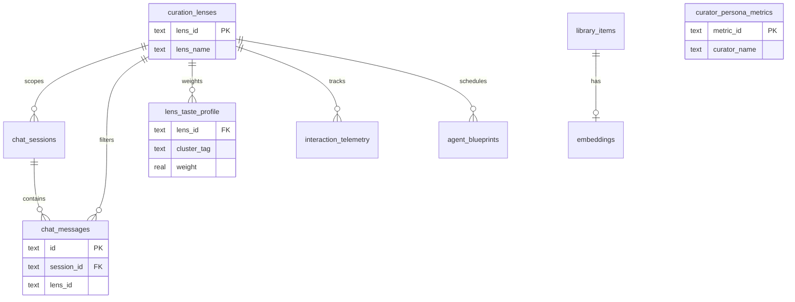

# CuratorX — Data Model

Reference for persistent storage: SQLite tables, settings fields, and Pydantic schemas. Schema definitions live in `curatorx/library/db.py` and `curatorx/models/schemas.py`.

---

## Storage layout

| Path | Format | Contents |
|------|--------|----------|
| `{DATA_DIR}/curatorx.db` | SQLite 3 | Library, embeddings, chat (lens-scoped), persona, lenses, preferences |
| `{DATA_DIR}/settings.json` | JSON | Connection settings and secrets |

Default `DATA_DIR`: `/config` in Docker, `./config` in local dev.

---

## SQLite schema

### Core library (Phase 1)

#### `library_items`

Canonical Plex index enriched during sync.

| Column | Type | Description |
|--------|------|-------------|
| `id` | INTEGER PK | Internal row ID |
| `rating_key` | TEXT UNIQUE | Plex rating key |
| `media_type` | TEXT | `movie` or `show` |
| `title` | TEXT | Display title |
| `year` | INTEGER | Release / first air year |
| `summary` | TEXT | Overview |
| `genres` | TEXT | JSON array |
| `cast` / `directors` / `keywords` | TEXT | JSON arrays |
| `tmdb_id` / `tvdb_id` / `imdb_id` | | External IDs |
| `poster_url` / `backdrop_url` | TEXT | Art URLs |
| `view_count` | INTEGER | Plex plays |
| `last_viewed_at` | INTEGER | Unix timestamp |
| `view_offset_ms` | INTEGER | Plex partial-watch offset (milliseconds) |
| `duration_ms` | INTEGER | Plex media duration (milliseconds) |
| `file_size` | INTEGER | Bytes on disk |
| `in_radarr` / `in_sonarr` | INTEGER | 0/1 queue flags |
| `updated_at` | REAL | Last upsert |

**Indexes:** `tmdb_id`, `tvdb_id`, `media_type`.

#### `embeddings`

| Column | Type | Description |
|--------|------|-------------|
| `item_id` | INTEGER PK FK | References `library_items.id` |
| `vector` | TEXT | JSON float array (384-dim hash or provider length) |

#### `preference_facts`

Taste signals for agent context and purge scoring.

| Column | Type | Description |
|--------|------|-------------|
| `id` | INTEGER PK | |
| `signal_type` | TEXT | `explicit`, `positive`, `negative`, `add`, `dismiss` |
| `text` | TEXT | Natural language description |
| `weight` | REAL | Signed weight |
| `tmdb_id` / `tvdb_id` / `media_type` | | Optional title scope |
| `created_at` | REAL | Unix timestamp |

#### `chat_sessions`

| Column | Type | Description |
|--------|------|-------------|
| `id` | TEXT PK | Session UUID |
| `created_at` / `updated_at` | REAL | |
| **`lens_id`** | TEXT | **Curation lens scope** (default `general`) |

#### `chat_messages`

| Column | Type | Description |
|--------|------|-------------|
| `id` | TEXT PK | Message UUID |
| `session_id` | TEXT FK | References `chat_sessions.id` |
| `role` | TEXT | `user`, `assistant`, `system` |
| `blocks_json` | TEXT | JSON message blocks |
| `created_at` | REAL | |
| **`lens_id`** | TEXT | **Lens filter for history queries** (default `general`) |

Chat history API and agent context load messages filtered by `lens_id` so lenses remain isolated within a session.

#### `message_feedback`

Helpful / not-helpful reactions on assistant messages (curator training signals).

| Column | Type | Description |
|--------|------|-------------|
| `id` | TEXT PK | Feedback row UUID |
| `message_id` | TEXT FK | References `chat_messages.id` |
| `session_id` | TEXT FK | References `chat_sessions.id` |
| `user_id` | TEXT FK nullable | References `users.id`; bootstrap owner when multi-user is off |
| `feedback_type` | TEXT | `helpful` or `not_helpful` |
| `excerpt` | TEXT | Truncated assistant message text sent to preference training |
| `created_at` | REAL | Unix timestamp |

Unique per `(message_id, user_id)`. POST feedback also writes a `positive` or `negative` row to `preference_facts` via `remember_preference`.

#### `watchlist_pins`

Personal shelf of titles pinned from chat title cards.

| Column | Type | Description |
|--------|------|-------------|
| `id` | TEXT PK | Pin UUID |
| `user_id` | TEXT FK nullable | References `users.id`; NULL when multi-user is off |
| `tmdb_id` | INTEGER | Movie TMDB id (optional) |
| `tvdb_id` | INTEGER | Show TVDB id (optional) |
| `media_type` | TEXT | `movie` or `show` |
| `title` | TEXT | Display title |
| `created_at` | REAL | Unix timestamp |

Unique per `(user_id, media_type, tmdb_id, tvdb_id)`.

#### `users`

Household accounts (schema present from Phase 0; login enforced only when `features.multi_user_enabled` is true).

| Column | Type | Description |
|--------|------|-------------|
| `id` | TEXT PK | CuratorX user id (`bootstrap-owner` for single-user installs) |
| `display_name` | TEXT | Shown in UI |
| `email` | TEXT | Optional |
| `role` | TEXT | `owner`, `member`, or `guest` |
| `plex_user_id` | TEXT UNIQUE | Plex account link |
| `plex_token_enc` | TEXT | Optional encrypted Plex token (Seerr bridge) |
| `seerr_user_id` | INTEGER | Cached Seerr user id |
| `seerr_permissions` | INTEGER | Cached Seerr permission bitmask |
| `oidc_sub` | TEXT UNIQUE | OIDC subject |
| `avatar_url` | TEXT | Optional |
| `created_at` | REAL | |
| `last_login_at` | REAL | |

On first run with multi-user disabled, a bootstrap **owner** row is inserted automatically.

#### `pending_actions`

Confirmation-gated *arr operations (10-minute TTL).

| Column | Type | Description |
|--------|------|-------------|
| `token` | TEXT PK | UUID hex |
| `action_type` | TEXT | `add_radarr`, `add_sonarr`, `remove_arr` |
| `payload_json` | TEXT | Action-specific JSON |
| `created_at` / `expires_at` | REAL | |

#### `sync_state`

Key-value job metadata (e.g. `last_sync` JSON with item/embedding counts).

---

### PRD cognitive tables (Phase 1)

From [curatorx_prd.md](curatorx_prd.md):

#### `curator_system_config`

| Column | Type | Description |
|--------|------|-------------|
| `config_key` | TEXT PK | e.g. `active_lens_id`, `curator_name` |
| `config_value` | TEXT | |
| `updated_at` | DATETIME | |

#### `service_integrations`

| Column | Type | Description |
|--------|------|-------------|
| `service_name` | TEXT PK | `plex`, `radarr`, `sonarr`, `tmdb`, … |
| `base_url` | TEXT | |
| `api_token_encrypted` | TEXT | Reserved for encrypted storage |
| `connection_status` | TEXT | `unverified`, `verified`, `error` |
| `last_tested_at` | DATETIME | |

#### `curator_persona_metrics`

| Column | Type | Description |
|--------|------|-------------|
| `metric_id` | TEXT PK | Default `current_profile` |
| `curator_name` | TEXT | Display name (default `Curator`) |
| `val_bro_prof` | REAL | Vocabulary: bro (0) → professorial (1) |
| `val_dipl_snark` | REAL | Tone: diplomatic (0) → snarky (1) |
| `val_pass_auto` | REAL | Autonomy: passive (0) → autonomous (1) |
| `last_modified` | DATETIME | |

#### `curation_lenses`

| Column | Type | Description |
|--------|------|-------------|
| `lens_id` | TEXT PK | e.g. `general`, `directors` |
| `lens_name` | TEXT | Display name |
| `description` | TEXT | Optional |
| `created_at` | DATETIME | |

Seeded on init: **`general`** lens.

#### `lens_taste_profile`

| Column | Type | Description |
|--------|------|-------------|
| `lens_id` | TEXT FK | References `curation_lenses` |
| `cluster_tag` | TEXT | Taste cluster identifier |
| `weight` | REAL | Default 1.0 |
| `explicit_lock` | INTEGER | 1 = block automatic telemetry updates |
| `last_updated` | DATETIME | |

**Primary key:** `(lens_id, cluster_tag)`.

#### `interaction_telemetry`

| Column | Type | Description |
|--------|------|-------------|
| `id` | TEXT PK | |
| `title_id` | TEXT | Library or external title reference |
| `lens_id` | TEXT FK | Lens context |
| `source` | TEXT | `chat_thread`, `tautulli_webhook`, `widget_input`, … |
| `event_type` | TEXT | `watch_complete`, `deep_query`, … |
| `watch_duration_seconds` | INTEGER | |
| `completion_percentage` | REAL | |
| `timestamp` | DATETIME | |

#### `agent_blueprints`

| Column | Type | Description |
|--------|------|-------------|
| `blueprint_id` | TEXT PK | |
| `name` | TEXT | e.g. Midnight Scavenger |
| `cron_schedule` | TEXT | Crontab string |
| `active_lens_id` | TEXT FK | Lens context for scheduled runs |
| `instructions_json` | TEXT | Serialized agent instructions |
| `is_enabled` | INTEGER | 0/1 |
| `last_run_status` / `last_run_timestamp` | | Job telemetry |

#### `user_title_reviews`

Personal 1–5 star ratings and optional free-text notes for titles you have watched. Separate from message helpful/not-helpful reactions.

| Column | Type | Description |
|--------|------|-------------|
| `id` | TEXT PK | Review UUID |
| `rating_key` | TEXT | Plex rating key when known |
| `tmdb_id` / `tvdb_id` | INTEGER | External IDs for lookup |
| `media_type` | TEXT | `movie` or `show` |
| `title` | TEXT | Display title |
| `stars` | INTEGER | 1–5 |
| `review_text` | TEXT | Optional short review |
| `review_tags` | TEXT | JSON array of taste tags |
| `prompted_by` | TEXT | `user`, `near_complete`, `slash_rate`, `curator_suggestion` |
| `session_id` | TEXT | Chat thread when captured in UI |
| `lens_id` | TEXT | Active lens |
| `plex_rating_synced` | INTEGER | Phase 5 Plex write-back flag |
| `created_at` / `updated_at` | REAL | Unix timestamps |

#### `rating_prompt_queue`

Proactive near-completion prompts (≥85% watched) surfaced in chat after library sync.

| Column | Type | Description |
|--------|------|-------------|
| `id` | TEXT PK | Prompt UUID |
| `rating_key` | TEXT UNIQUE | Plex item or episode key |
| `media_type` | TEXT | `movie` or `show` |
| `title` | TEXT | Prompt headline |
| `completion_pct` | REAL | Detected watch progress |
| `detected_at` | REAL | When queued |
| `prompted_at` | REAL | When the prompt was shown in chat |
| `dismissed_at` | REAL | Skip — 30-day cooldown before re-prompt |
| `review_id` | TEXT | Linked `user_title_reviews.id` after save |

---

## Settings model

Python dataclass `Settings` in `curatorx/config_store.py`, persisted as `settings.json`. Environment variables override file values.

See [CONFIGURATION.md](CONFIGURATION.md) for the full field list. Secret fields are masked on `GET /api/settings` with `{field}_set` booleans.

Persona sliders and curator name are **not** in `settings.json` — they live in `curator_persona_metrics` and `curator_system_config`.

---

## Pydantic schemas

Defined in `curatorx/models/schemas.py`.

### Lens and persona

| Model | Key fields |
|-------|------------|
| `Lens` | `lens_id`, `lens_name`, `description`, `created_at` |
| `LensCreate` | `lens_id`, `lens_name`, `description` |
| `ActiveLensUpdate` | `lens_id` |
| `PersonaMetrics` | `curator_name`, `val_bro_prof`, `val_dipl_snark`, `val_pass_auto` |

### Chat (lens-aware)

| Model | Key fields |
|-------|------------|
| `ChatRequest` | `message`, `session_id`, **`lens_id`** (optional) |
| `ChatMessage` | `id`, `role`, `blocks`, **`lens_id`** |
| `ChatMessageBlock` | `type`, `content`, `items`, `action`, `payload` |

### Titles and actions

| Model | Purpose |
|-------|---------|
| `TitleCard` / `TitleDetail` | Card and detail page payloads |
| `PreferenceSignal` | Taste signals; optional `lens_id` |
| `ActionConfirmRequest` | Confirmation token execution |

---

## Entity relationships

---

## Related documentation

- [ARCHITECTURE.md](ARCHITECTURE.md) — sync and chat data flows
- [DESIGN.md](DESIGN.md) — block schema and API usage
- [curatorx_prd.md](curatorx_prd.md) — product source spec
