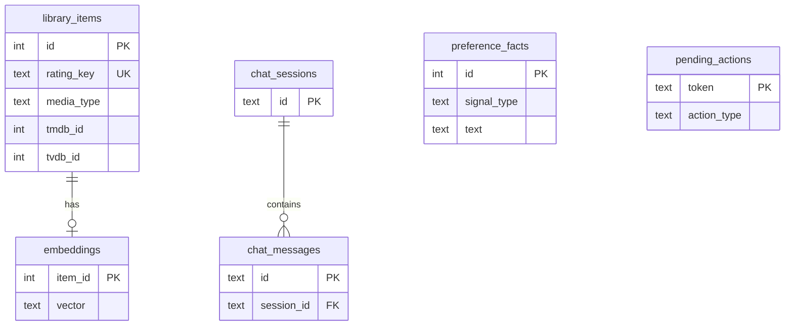

# MediaCurator — Data Model

Reference for persistent storage: SQLite tables, settings fields, and key Pydantic schemas. Schema definitions live in `mediacurator/library/db.py` and `mediacurator/models/schemas.py`.

---

## Storage layout

| Path | Format | Contents |
|------|--------|----------|
| `{DATA_DIR}/mediacurator.db` | SQLite 3 | Library index, embeddings, chat, preferences, pending actions |
| `{DATA_DIR}/settings.json` | JSON | User configuration (secrets on disk) |

Default `DATA_DIR`: `/config` in Docker, `./config` in local dev.

---

## SQLite schema

### `library_items`

Canonical index of Plex movies and shows, enriched during sync.

| Column | Type | Description |
|--------|------|-------------|
| `id` | INTEGER PK | Internal row ID |
| `rating_key` | TEXT UNIQUE | Plex rating key |
| `media_type` | TEXT | `movie` or `show` |
| `title` | TEXT | Display title |
| `year` | INTEGER | Release / first air year |
| `summary` | TEXT | Overview from Plex |
| `genres` | TEXT | JSON array of genre strings |
| `cast` | TEXT | JSON array |
| `directors` | TEXT | JSON array |
| `keywords` | TEXT | JSON array (TMDB keywords for movies) |
| `tmdb_id` | INTEGER | TMDB ID |
| `tvdb_id` | INTEGER | TVDB ID |
| `imdb_id` | TEXT | IMDB ID |
| `poster_url` | TEXT | Resolved poster URL |
| `backdrop_url` | TEXT | Resolved backdrop URL |
| `view_count` | INTEGER | Plex view count |
| `last_viewed_at` | INTEGER | Unix timestamp |
| `file_size` | INTEGER | Bytes on disk (Plex) |
| `in_radarr` | INTEGER | 0/1 flag from sync |
| `in_sonarr` | INTEGER | 0/1 flag from sync |
| `updated_at` | REAL | Last upsert timestamp |

**Indexes:** `tmdb_id`, `tvdb_id`, `media_type`.

### `embeddings`

One vector per library item for semantic search.

| Column | Type | Description |
|--------|------|-------------|
| `item_id` | INTEGER PK FK | References `library_items.id` |
| `vector` | TEXT | JSON array of floats |

Vectors are typically 384 dimensions (hash fallback) or provider-defined length (e.g. 1536 for `text-embedding-3-small`).

### `preference_facts`

Taste signals for agent context and purge scoring.

| Column | Type | Description |
|--------|------|-------------|
| `id` | INTEGER PK | |
| `signal_type` | TEXT | `explicit`, `positive`, `negative`, `add`, `dismiss` |
| `text` | TEXT | Natural language or description |
| `weight` | REAL | Signed weight (see DESIGN.md) |
| `tmdb_id` | INTEGER | Optional title scope |
| `tvdb_id` | INTEGER | Optional title scope |
| `media_type` | TEXT | Optional `movie` / `show` |
| `created_at` | REAL | Unix timestamp |

### `chat_sessions`

| Column | Type | Description |
|--------|------|-------------|
| `id` | TEXT PK | Client-provided or server-generated session UUID |
| `created_at` | REAL | |
| `updated_at` | REAL | Updated on each message |

### `chat_messages`

| Column | Type | Description |
|--------|------|-------------|
| `id` | TEXT PK | Message UUID |
| `session_id` | TEXT FK | References `chat_sessions.id` |
| `role` | TEXT | `user`, `assistant`, or `system` |
| `blocks_json` | TEXT | JSON array of message blocks |
| `created_at` | REAL | |

Blocks follow the schema in [DESIGN.md](DESIGN.md#message-block-schema).

### `pending_actions`

Confirmation-gated *arr operations.

| Column | Type | Description |
|--------|------|-------------|
| `token` | TEXT PK | UUID hex token |
| `action_type` | TEXT | `add_radarr`, `add_sonarr`, `remove_arr` |
| `payload_json` | TEXT | Action-specific JSON |
| `created_at` | REAL | |
| `expires_at` | REAL | Default TTL 600 seconds from creation |

### `sync_state`

Key-value store for job metadata.

| Column | Type | Description |
|--------|------|-------------|
| `key` | TEXT PK | e.g. `last_sync` |
| `value` | TEXT | JSON string |
| `updated_at` | REAL | |

`last_sync` value example:

```json
{"items": 1240, "embeddings": 1240, "timestamp": 1710000000.0}
```

---

## Settings model

Python dataclass `Settings` in `mediacurator/config_store.py`, persisted as `settings.json`. Environment variables override file values when set.

### Connection settings

| Field | Env var | Description |
|-------|---------|-------------|
| `plex_url` | `PLEX_URL` | Plex server base URL |
| `plex_token` | `PLEX_TOKEN` | Plex token |
| `plex_movie_section` | `PLEX_MOVIE_SECTION` | Movie library section key |
| `plex_tv_section` | `PLEX_TV_SECTION` | TV library section key |
| `radarr_url` | `RADARR_URL` | Radarr base URL |
| `radarr_api_key` | `RADARR_API_KEY` | Radarr API key |
| `sonarr_url` | `SONARR_URL` | Sonarr base URL |
| `sonarr_api_key` | `SONARR_API_KEY` | Sonarr API key |

### Paths and *arr defaults

| Field | Env var | Default | Description |
|-------|---------|---------|-------------|
| `movies_root` | `MOVIES_ROOT` | `/media/movies` | Legacy path hint |
| `tv_root` | `TV_ROOT` | `/media/tv` | Legacy path hint |
| `radarr_root_folder` | `RADARR_ROOT_FOLDER` | `/media/movies` | Add-movie root |
| `sonarr_root_folder` | `SONARR_ROOT_FOLDER` | `/media/tv` | Add-series root |
| `radarr_quality_profile_id` | `RADARR_QUALITY_PROFILE_ID` | `1` | Quality profile for adds |
| `sonarr_quality_profile_id` | `SONARR_QUALITY_PROFILE_ID` | `1` | Quality profile for adds |

### Metadata APIs

| Field | Env var | Description |
|-------|---------|-------------|
| `tmdb_api_key` | `TMDB_API_KEY` | Required for discovery |
| `tvdb_api_key` | `TVDB_API_KEY` | Configured; **not yet used in sync** |
| `fanart_api_key` | `FANART_API_KEY` | Optional poster/backdrop art |
| `tautulli_url` | `TAUTULLI_URL` | Optional watch stats |
| `tautulli_api_key` | `TAUTULLI_API_KEY` | Tautulli API key |

### LLM settings

| Field | Env var | Default | Description |
|-------|---------|---------|-------------|
| `llm_provider` | `LLM_PROVIDER` | `openai_compatible` | `openai_compatible`, `anthropic`, `ollama` |
| `llm_base_url` | `LLM_BASE_URL` | `https://api.openai.com/v1` | Chat completions base |
| `llm_api_key` | `LLM_API_KEY` | | Provider API key |
| `llm_model` | `LLM_MODEL` | `gpt-4o-mini` | Chat model name |
| `llm_embedding_model` | `LLM_EMBEDDING_MODEL` | `text-embedding-3-small` | Embeddings model |
| `llm_embedding_base_url` | `LLM_EMBEDDING_BASE_URL` | | Overrides embedding endpoint |

### Application flags

| Field | Description |
|-------|-------------|
| `onboarding_complete` | User finished setup wizard |
| `setup_wizard_pending` | Internal wizard state |
| `library_sync_interval_hours` | Auto-sync interval (1–168, default 24) |
| `tv_page_size` | Plex TV fetch page size (50–2000, default 500) |

Secret fields masked on API read: `plex_token`, `radarr_api_key`, `sonarr_api_key`, `tmdb_api_key`, `tvdb_api_key`, `fanart_api_key`, `tautulli_api_key`, `llm_api_key`. Response includes `{field}_set: bool` instead.

---

## Pydantic schemas

Defined in `mediacurator/models/schemas.py`.

### `TitleCard`

Display model for cards. See [DESIGN.md](DESIGN.md#titlecard-and-titledetail).

### `TitleDetail`

Extends `TitleCard` with `cast`, `directors`, `keywords`, `file_size_bytes`, `view_count`, `last_viewed_at`, `arr_id`, `purge_score`, `purge_reason`.

### `ChatMessageBlock`

| Field | Type | Notes |
|-------|------|-------|
| `type` | `text` \| `title_cards` \| `action_prompt` | Block discriminator |
| `content` | str | For `text` |
| `items` | `TitleCard[]` | For `title_cards` |
| `action` | str | For `action_prompt`, e.g. `open_viewport` |
| `payload` | dict | Action-specific data |

### `ChatMessage`

| Field | Type |
|-------|------|
| `id` | str |
| `role` | `user` \| `assistant` \| `system` |
| `blocks` | `ChatMessageBlock[]` |
| `created_at` | float |

### `ChatRequest`

| Field | Type |
|-------|------|
| `message` | str |
| `session_id` | str? |

### `ActionConfirmRequest`

| Field | Type | Default |
|-------|------|---------|
| `token` | str | |
| `confirmed` | bool | `true` |

### `PreferenceSignal`

| Field | Type |
|-------|------|
| `signal_type` | `explicit` \| `positive` \| `negative` \| `add` \| `dismiss` |
| `text` | str |
| `tmdb_id` | int? |
| `tvdb_id` | int? |
| `media_type` | `movie` \| `show`? |

### `ViewportPayload`

| Field | Type |
|-------|------|
| `title` | str |
| `items` | `TitleCard[]` |

---

## Entity relationships



---

## Related documentation

- [ARCHITECTURE.md](ARCHITECTURE.md) — how data flows through sync and chat
- [DESIGN.md](DESIGN.md) — API and block schema usage
- [CONFIGURATION.md](CONFIGURATION.md) — operator-facing settings guide
