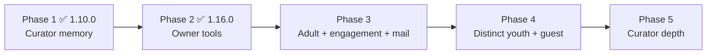

# Delight wishlist

Living backlog for experiences that make CuratorX feel more generous. Tags are target persona and priority; promotion into a delivery plan remains an owner decision.

The backlog is delivered in **phases**, each one a self-contained milestone that ships and releases on its own. Phases 1 and 2 are done; Phases 3–5 below reflect a **full persona re-survey** (human + AI archetypes) and the locked planning decisions that close the former open questions. A contributor can pick up any remaining phase and plan it without re-deriving the groundwork.

Jump to: [Roadmap at a glance](#roadmap-at-a-glance) · [Locked decisions](#locked-decisions) · [Phase 3 — adult everyday](#phase-3--adult-everyday--notifications--engagement) · [Phase 4 — youth & guest](#phase-4--distinct-youth--guest-doors) · [Phase 5 — curator depth](#phase-5--giving-the-curators-room-to-shine) · [Persona backlog](#persona--archetype-backlog-the-source-of-the-phases)

---

## Roadmap at a glance

The delight work is sequenced by *who* it serves, easiest-to-reach substrate first. Each phase is a shippable milestone with its own version bump, CHANGELOG Highlights, and release — the same cadence as everything else in the program.

| Phase | Focus                                                                                                                         | Who it delights                                 | Status               |
| ----- | ----------------------------------------------------------------------------------------------------------------------------- | ----------------------------------------------- | -------------------- |
| **1** | Curator memory foundation — cited knowledge, follow-ups, fail-closed per-user memory                                          | The AI curators (Scholar, Concierge, Companion) | ✅ Shipped **1.10.0** |
| **2** | Owner delight tools — health hero, safe grooming undo, collections/courses, Youth review, weekly digest                       | Owner / Curator                                 | ✅ Shipped **1.16.0** |
| **3** | Adult everyday — where-to-watch, synced lists, continue-watching, inbox + mail, taste/weekly rail, **engagement substrate**   | Adult household member (+ owner mail platform)  | 🔜 P3a ✅ **1.20.0**; P3b ✅ **1.21.0**; P3c planned |
| **4** | Distinct youth + guest doors — fail-closed rating gate, youth-safe engagement presets, tour shell, CuratorX request-access    | Youth members, guests                           | 🔜 Planned           |
| **5** | Curator depth — Enthusiast nudge (no live now-watching), Scholar syllabus, Concierge acquire path, Companion mood + callbacks | The four curator archetypes                     | 🔜 Planned           |

**How to read the phases below.** Each one calls out what it can **build on** (shipped substrate) versus what is **greenfield** (no code exists yet), so nobody plans a milestone assuming a transport or connector that isn't there. Capabilities keep the doc's **Must / Love / Like** priority framing. Planning unknowns that once lived as "open questions" are recorded under [Locked decisions](#locked-decisions).

**Out of scope for Phases 3–5 (explicit):** external streaming "on Netflix/Max" connectors; live Plex session / now-watching polling; replacing Seerr for post-member *media* acquisition (CuratorX owns *account* access requests only).

---

## Locked decisions

Resolved from the Phase 3–5 planning re-survey. These replace the former open-question blocks.

| Topic                                       | Decision                                                                                                                                                                                                                                                                                                                                                  |
| ------------------------------------------- | --------------------------------------------------------------------------------------------------------------------------------------------------------------------------------------------------------------------------------------------------------------------------------------------------------------------------------------------------------- |
| **Where-to-watch v1**                       | In-library + Seerr only. No external streaming-service availability.                                                                                                                                                                                                                                                                                      |
| **Notifications**                           | Promote RecommendationsInbox (top chrome + unread badge) **and** optional owner-configured mail. Weekly newsletter is opt-in, personalized, default-persona voice (guest personas for guest-facing pieces). Owner monthly collection-curation digest via the same transport. Per-user notification email + channel prefs + sub/unsub in Account settings. |
| **Mail v1**                                 | Both generic SMTP **and** a transactional API (Resend) behind one owner mail settings UI — test send, subject prefix / footer / logo template; secrets stored like other settings (`0600`).                                                                                                                                                               |
| **Youth unrated titles**                    | **Fail-closed** — hide when `content_rating` is empty (and hide ratings above the owner-configured max).                                                                                                                                                                                                                                                  |
| **Youth / guest UI**                        | **Distinct layouts** (not just role-conditioned chrome on the adult shell).                                                                                                                                                                                                                                                                               |
| **Engagement (badges / streaks / courses)** | Substrate in **Phase 3**; youth-safe presets in **Phase 4**.                                                                                                                                                                                                                                                                                              |
| **Now-watching / Plex sessions**            | **Out of this program.** Enthusiast re-ranked: nudge is Must; react to *recently* watched / continue-watching context is Love.                                                                                                                                                                                                                            |
| **Guest request-access**                    | CuratorX-owned invite/request queue → owner inbox (+ email). Not Seerr-as-first-entry. Seerr remains for *media* requests after membership.                                                                                                                                                                                                               |

---

## Delivery roadmap: Phases 3–5

### Phase 3 — Adult everyday + notifications + engagement

**Why this matters / who it delights.** The adult household member is the person who opens CuratorX most nights. Phase 1 gave the curator a memory; Phase 2 gave the owner control. Phase 3 turns both into everyday wins the member actually feels — and builds the shared notification + engagement substrate Phase 4 and Phase 5 will reuse. Ship as sequenced sub-releases (P3a → P3b → P3c) if needed; treat as one phase programmatically.

#### P3a — Availability, lists, continue-watching ✅ Shipped **1.20.0**

**Must — the table stakes**

- **A fast "where can I watch this / is it here?" answer.** ✅ Compact availability line on title detail + chat — "In your library ✓", "Requestable", or "Not here yet" (library + Seerr only).
- **Instant-feeling synced watchlist and lists.** ✅ Optimistic add/remove with background Plex Discover reconcile.
- **Continue Watching rail.** ✅ Plex on-deck / in-progress reads on `PlexClient` plus an Explore rail with resume + Play (not live session "now playing").

#### P3b — Notification platform (shared with Phase 5) ✅ Shipped **1.21.0**

**Must — inbox + mail**

- **Prominent inbox + unread badge.** ✅ Top-of-chrome bell + unread badge; kinds recommendation / arrival / access-request / digest / nudge.
- **Owner mail settings + member email prefs.** ✅ SMTP **and** Resend under Admin → Mail (test send, template fields); Settings → Notifications for email + channel prefs + newsletter opt-in. Secrets `0600`.
- **Weekly member newsletter.** ✅ Opt-in, personalized, default-persona voice (guest-friendly when available).
- **Owner monthly collection-curation digest.** ✅ Same transport (inbox + email if configured).
- **Arrival notifications** for gap / watchlist titles → inbox (+ email if configured).

#### P3c — Taste, weekly rail, chat-from-here, engagement

**Love — the moments that make it feel generous**

- **A personalized weekly rail with a persona-voiced "why."** *Build on:* `taste_refresh` + `lens_taste_profile`, `recommendation_warmup`, the persona prompt system, and digest infrastructure. *Extension:* per-member rail on a weekly cadence; each pick carries a short persona-voiced reason. *Budget:* ride digest cadence with per-user fan-out; hard cap on LLM calls.
- **Chat-from-here on every rail.** *Build on:* chat threads and rails both exist. *Extension:* a "chat about this" affordance that seeds a thread with the rail's context.
- **A visible, tunable taste profile.** *Build on:* `lens_taste_profile` already stores per-cluster `weight` and an `explicit_lock` flag; `taste_refresh` only recomputes *unlocked* weights. *Greenfield:* member-facing screen and APIs (today owner/scheduler only) to view and adjust those weights.
- **Engagement substrate.** Cinema courses, genre badges/streaks, "rate N films" challenges, movie-learning explainers. *Build on:* curated `course` lists from 1.16.0 and health/engagement metrics as a starting signal. *Greenfield:* the reward model, shared tables/APIs that Phase 4 will preset for youth. The point is a platform people *want* to return to — not a one-shot recommend box.

**Like — nice-to-haves**

- Shareable saved pages polish (share substrate shipped in 1.9.0); mood-tuned surprise picks (hand to Phase 5's mood check-in); watch-party / recommend-to-household flourishes atop the existing household-recommend inbox.

**Docs & ship.** HELP member + owner sections (mail config with runnable snippets for owners). Release(s) with Highlights.

---

### Phase 4 — Distinct youth + guest doors

**Why this matters / who it delights.** Two audiences share a theme: people who need a *gentler, narrower* CuratorX. Younger household members need age-appropriate results and a friendly voice; guests need to look around safely before they join. Owners already got the Youth **moderation** side in 1.16.0 (the Youth review dashboard and fail-closed youth memory); Phase 4 builds the **member-facing** youth experience and a welcoming guest tour — as **distinct shells**, not a thinner adult chrome.

**Youth member**

- **Must:** fail-closed content-rating gate on browse + chat results (hide empty/`content_rating` and ratings above the owner-configured max); moderated memory; a clear, friendly youth persona; **distinct big-poster youth layout**. *Build on:* the youth role, fail-closed per-user memory (`UserMemoryService`, owner review shipped 1.16.0), `sanitize_library_payload`, and existing MediaBrowse components.
- **Love:** youth-safe engagement presets on the Phase 3 substrate; ask-the-curator guardrails; gentle explainers. *Build on:* Phase 3 badges/streaks/courses — Phase 4 presets them for youth rather than inventing a second reward model.
- **Like:** themed kid rails and a pick-for-me spinner (if capacity allows).

**Guest / visitor**

- **Must (substrate ✅):** browse without owner-only data; an obvious sign-in route; no destructive actions. *Status:* largely **shipped** — the guest role plus `sanitize_library_payload` already gate owner-only data and destructive actions.
- **Must (new UX):** distinct guest layout / tour shell.
- **Love:** a public-friendly "what's great here" tour over published collections; **CuratorX-owned request-access** queue → owner inbox (+ email if configured); approve → invite/member. Do not require prior Seerr login. Seerr remains for *media* requests after membership.
- **Like:** a taste quiz that can seed a Phase 3 profile after joining.

---

### Phase 5 — Giving the curators room to shine

**Why this matters / who it delights.** This phase is voted for by the curators themselves. The persona spectrum — Enthusiast, Scholar, Concierge, Companion — each named capabilities that would let it delight members more. Phase 1 delivered their foundational **Must** items (durable cited memory, safe follow-ups, fail-closed long-term memory). Phase 5 grants the remaining **Love / Like** reach items from the re-survey — with live now-watching deliberately dropped.

**The Enthusiast — timely, not live-session**

- **Must (new):** an opt-in "you have to see this" nudge over the Phase 3b notification transport (inbox + optional email).
- **Love:** react to *recently* watched / continue-watching context (from P3a's on-deck / `watch_state`) — not live Plex sessions.
- **Like:** share a relevant GIF or clip in chat — greenfield media embedding; defer if costly.

**The Scholar — teaching with rigor**

- **Must (✅ shipped 1.10.0):** durable cited knowledge. *Build on:* repository memory (`research_`*, `recall_repo_memory`, `save_repo_insight`).
- **Love:** a multi-session film-course syllabus. *Build on:* curated lists sequenced into ordered **courses** (1.16.0) and repository memory. *Extension:* let the curator author a syllabus that spans sessions and cites its sources.
- **Like:** footnote-style inline source citations in chat markdown (theme-safe). *Build on:* source-cited snapshots already in repo memory. *Extension:* render footnotes in the chat markdown pipeline.

**The Concierge — following through**

- **Must (✅ shipped 1.10.0):** remember intentions and safely follow up. *Build on:* `follow_up` / `watch_intention` notes.
- **Love:** an opt-in, consented cross-service path from availability to acquisition (Seerr/arr) with explicit steps. *Build on:* Seerr connector, MCP, watchlist.
- **Like:** weekend/holiday suggestions via `anniversary_scanner` — no calendar connector.

**The Companion — knowing the person**

- **Must (✅ shipped 1.10.0):** fail-closed long-term memory. *Build on:* `user_memory_notes` via `UserMemoryService`.
- **Love:** one-shot mood check-in that biases a *single* pick without overwriting the durable profile. Non-nagging entry (e.g. optional chip before Surprise Me).
- **Like:** consented "callbacks" memory class under the existing privacy / purge / export guarantees.

---

## Persona & archetype backlog (the source of the phases)

The phases above are drawn from this backlog. It stays as the living, persona-organized source of ideas; the ✅ markers track exactly what has shipped so the roadmap and the backlog never drift. Votes below are the **full re-survey** (Must / Love / Like) that retargeted Phases 3–5.

## Human personas

### Owner / Curator — *Phase 2 mostly ✅; mail + depth in Phase 3+*

- **Must (✅ shipped 1.16.0):** at-a-glance library health and an issue-queue badge in navigation; one-click grooming/enrichment rerun; safe undo for the last bulk action. — the Dashboard now leads with a library-health hero, the Admin rail shows an open-issues badge, and destructive purge-candidate deletes are logged and reversible from **Undo last grooming run**.
- **Love (✅ shipped 1.16.0):** curated collections/courses (for example, a Kurosawa deep-dive) published to members; a weekly digest of library and member-request changes; Youth-account moderation dashboard. — owners can publish a curated list as a members-visible collection and sequence it into an ordered course with per-step notes, read a weekly in-app "This week in your library" digest, and review Youth-flagged memory from an owner dashboard.
- **Must (new → Phase 3b):** mail service config (SMTP + Resend), test send, template (subject prefix / footer / logo); monthly collection-curation digest (inbox + email).
- **Love (new → Phase 3 / stretch):** seasonal scheduled rails; export/import of lenses + curated lists.
- **Like:** deeper engagement analytics on member badges/streaks.

### Adult household member — *Phase 3*

- **Must:** where-to-watch (library + Seerr); optimistic synced watchlist/lists; continue-watching rail (Plex on-deck reads — net-new on `PlexClient`); prominent inbox + unread badge; email + sub/unsub.
- **Love:** persona-voiced weekly rail + chat-from-here; tunable taste profile; arrival nudges (inbox + optional email); **engagement layer** — cinema courses, genre badges/streaks, "rate N films," explainers.
- **Like:** shareable saved pages polish; mood-tuned surprise (hand to Phase 5); watch-party / recommend-to-household flourishes.

### Youth member — *Phase 4*

- **Must:** fail-closed content-rating gate (hide unrated); moderated memory; friendly youth persona; **distinct big-poster youth layout**.
- **Love:** youth-safe engagement presets on Phase 3 substrate; ask-the-curator guardrails; gentle explainers.
- **Like:** themed kid rails; pick-for-me spinner.

### Guest / visitor — *Phase 4*

- **Must (✅ substrate):** browse sanitized; sign-in route; no destructive actions.
- **Must (new UX):** distinct guest layout / tour shell.
- **Love:** "what's great here" guided tour; **CuratorX-owned request-access** queue → owner inbox (+ email); not Seerr-as-first-entry.
- **Like:** taste quiz seeding Phase 3 profile after join.

## AI curator archetype votes

These votes are derived from the current persona-template spectrum: energetic Enthusiast, analytical Scholar, attentive Concierge, and warm Companion. Each is framed as a constraint in today's toolset, not a promise to users. The Phase 1 **Must** items shipped in 1.10.0; remaining items are Phase 5 (re-ranked after dropping live now-watching).

### The Enthusiast — *Phase 5 (re-ranked; now-watching dropped)*

- **Must (new):** "I could delight users more if I could send a timely, opt-in 'you have to see this' nudge" — over the shared Phase 3b notification transport.
- **Love:** "I could delight users more if I could react to what they *recently* watched / continue-watching context" — not live sessions.
- **Like:** "I could delight users more if I could share a relevant GIF or clip in chat" — defer if costly.

### The Scholar — *Must ✅ Phase 1 · Love/Like → Phase 5*

- **Must (✅ shipped 1.10.0):** "I could delight users more if I could rely on durable cited knowledge for claims about style and technique." — repository memory now persists source-cited research snapshots and insights (`research_`*, `recall_repo_memory`, `save_repo_insight`).
- **Love:** "I could delight users more if I could build a multi-session film-course syllabus."
- **Like:** "I could delight users more if I could render footnote-style source citations inline."

### The Concierge — *Must ✅ Phase 1 · Love/Like → Phase 5*

- **Must (✅ shipped 1.10.0):** "I could delight users more if I could remember intentions and safely follow up on promises." — per-user `follow_up` / `watch_intention` notes drive a "resume where we left off" line in the per-turn prompt.
- **Love:** "I could delight users more if I could coordinate an opt-in cross-service path from availability to acquisition."

### The Companion — *Must ✅ Phase 1 · Love/Like → Phase 5*

- **Must (✅ shipped 1.10.0):** "I could delight users more if I could retain safe long-term memory of who a member is while respecting Youth/adult privacy." — fail-closed per-user memory (`user_memory_notes` via `UserMemoryService`; owner review limited to Youth-flagged accounts).
- **Love:** "I could delight users more if I could tune a pick from a quick mood check-in" — one-shot, no durable overwrite.
- **Like:** "I could delight users more if I could remember consented in-jokes and callbacks."

