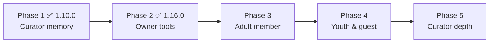

# Delight wishlist

Living backlog for experiences that make CuratorX feel more generous. Tags are target persona and priority; promotion into a delivery plan remains an owner decision.

The backlog is delivered in **phases**, each one a self-contained milestone that ships and releases on its own. Phases 1 and 2 are done; Phases 3–5 are outlined below in enough detail that a future contributor can pick one up and plan it without re-deriving the groundwork.

Jump to: [Roadmap at a glance](#roadmap-at-a-glance) · [Phase 3 — adult member](#phase-3--the-adult-members-everyday) · [Phase 4 — youth & guest](#phase-4--a-safe-friendly-door-for-youth-and-guests) · [Phase 5 — curator depth](#phase-5--giving-the-curators-room-to-shine) · [Persona backlog](#persona--archetype-backlog-the-source-of-the-phases)

---

## Roadmap at a glance

The delight work is sequenced by *who* it serves, easiest-to-reach substrate first. Each phase is a shippable milestone with its own version bump, CHANGELOG Highlights, and release — the same cadence as everything else in the program.

| Phase | Focus | Who it delights | Status |
|-------|-------|-----------------|--------|
| **1** | Curator memory foundation — cited knowledge, follow-ups, fail-closed per-user memory | The AI curators (Scholar, Concierge, Companion) | ✅ Shipped **1.10.0** |
| **2** | Owner delight tools — health hero, safe grooming undo, collections/courses, Youth review, weekly digest | Owner / Curator | ✅ Shipped **1.16.0** |
| **3** | The adult member's everyday — where-to-watch, synced lists, resume, personalized rail, tunable taste, arrival nudges | Adult household member | 🔜 Planned |
| **4** | A safe, friendly door — a moderated youth experience and a welcoming guest tour | Youth members, guests | 🔜 Planned |
| **5** | Curator depth — the "love/like" reach items the personas voted for | The four curator archetypes | 🔜 Planned |

**How to read the phases below.** Each one calls out what it can **build on** (shipped substrate) versus what is **greenfield** (no code exists yet), so nobody plans a milestone assuming a transport or connector that isn't there. Capabilities keep the doc's **Must / Love / Like** priority framing. Every phase ends with the **open questions** to resolve at planning time — honest unknowns, not hand-waving.

---

## Delivery roadmap: Phases 3–5

### Phase 3 — The adult member's everyday

**Why this matters / who it delights.** The adult household member is the person who opens CuratorX most nights. Phase 1 gave the curator a memory; Phase 2 gave the owner control. Phase 3 turns both into everyday wins the member actually feels: a fast answer to "can we watch this here?", lists that feel instant, "pick up where you left off" surfaced without asking, a weekly rail chosen *for them* with a reason attached, a taste profile they can see and nudge, and a heads-up when a title they wanted finally lands.

**Must — the table stakes**
- **A fast "where can I watch this / is it here?" answer.** *Build on:* the curator already resolves in-library matches (`library_item_by_rating_key`) and offers **Play** when a Plex match exists; the Seerr connector (`curatorx/connectors/seerr.py`) knows request/acquire status. *Extension:* a compact availability line on the title detail drawer and in chat — "In your library ✓", "Requestable", or "Not here yet". *Greenfield:* external streaming-service availability ("it's on Netflix/Max") — there is no provider-availability connector today; scope v1 to in-library + Seerr and decide separately whether to add one.
- **Instant-feeling synced watchlist and lists.** *Build on:* the watchlist substrate is real — `curatorx/watchlist/` (`plex_sync`, `plex_discover`, `curate`), the `_watchlist` DB mixin, `WatchlistSyncRequest` / `SyncScheduler`, and `WatchlistPage.jsx`; curated lists and collections shipped in 1.16.0. *Extension:* optimistic add/remove with background reconciliation both directions against the Plex watchlist, so the UI never waits on a round-trip.
- **Resume / continue-watching surfaced.** *Build on:* `curatorx/library/watch_state.py` tracks `view_count` / `last_viewed_at` and scrobbles to Plex, and the Concierge's `follow_up` / `watch_intention` notes (shipped 1.10.0) already drive a "resume where we left off" line in chat. *Greenfield:* a true continue-watching rail needs Plex **on-deck / in-progress session** reads — `PlexClient` scrobbles but does not yet read on-deck — so that endpoint is net-new.

**Love — the moments that make it feel generous**
- **A personalized weekly rail with a persona-voiced "why."** *Build on:* `taste_refresh` + the `lens_taste_profile` table, the `recommendation_warmup` task, the persona prompt system, and the digest infrastructure from M4 (`curatorx/digest/service.py`, the `weekly_digest` scheduler task) — today owner-facing and in-app only. *Extension:* assemble a per-member rail on a weekly cadence, each pick carrying a short persona-voiced reason.
- **Chat-from-here on every rail.** *Build on:* chat threads and rails both exist. *Extension:* a "chat about this" affordance that seeds a thread with the rail's context.
- **A visible, tunable taste profile.** *Build on:* `lens_taste_profile` already stores per-cluster `weight` and an `explicit_lock` flag, and `taste_refresh` only recomputes *unlocked* weights — the locking substrate is there. *Greenfield:* a member-facing screen to view and adjust those weights (honoring `explicit_lock`).
- **Arrival notifications for gap titles.** *Build on:* `gap_analysis` already finds missing titles, `anniversary_scanner` surfaces seasonal ones, and `RecommendationsInbox.jsx` is a proven in-app delivery surface. *Greenfield:* there is **no push/email/webhook transport** — per M4 the weekly digest is deliberately in-app only. This is the key decision (see open questions).

**Like — nice-to-haves**
- Shareable saved pages (share substrate shipped in 1.9.0); mood-tuned surprise picks (defer to Phase 5's mood check-in); watch-party / recommend-to-household flourishes atop the existing household-recommend inbox.

**Open questions to resolve at planning time**
- Where-to-watch scope: in-library + Seerr only for v1, or invest in an external provider-availability connector?
- **Notification transport** — in-app inbox (reuse the `RecommendationsInbox` pattern) vs. email/webhook. This is shared with Phase 5's Enthusiast nudge and is the single biggest greenfield dependency in the delight backlog.
- Per-member rail cost and cadence — can it ride the existing digest scheduler, or does per-user generation need its own budget?

---

### Phase 4 — A safe, friendly door for youth and guests

**Why this matters / who it delights.** Two audiences share a theme: people who need a *gentler, narrower* CuratorX. Younger household members need age-appropriate results and a friendly voice; guests need to look around safely before they join. Owners already got the Youth **moderation** side in 1.16.0 (the Youth review dashboard and fail-closed youth memory); Phase 4 builds the **member-facing** youth experience and a welcoming guest tour.

**Youth member**
- **Must:** age-appropriate results and moderated memory; a clear, friendly persona voice; simple big-poster browsing. *Build on:* the youth role, fail-closed per-user memory (`UserMemoryService`, owner review shipped 1.16.0), `sanitize_library_payload`, and the existing MediaBrowse components. *Extension:* a youth-tuned persona/guardrail preset and a simplified big-poster browse layout. *Greenfield:* a content-rating gate on browse and chat results for youth accounts — feasible only where content ratings are populated, so coverage must be checked first.
- **Love:** gentle movie-learning explainers (curator + the curated-lists/courses substrate from 1.16.0); genre exploration badges/streaks; ask-the-curator guardrails. *Greenfield:* the badges/streaks gamification layer (the health/engagement metrics are a starting signal, but the reward model is net-new).
- **Like:** themed kid rails and a pick-for-me spinner.

**Guest / visitor**
- **Must:** browse without owner-only data; an obvious sign-in route; no destructive actions. *Status:* largely **shipped** — the guest role plus `sanitize_library_payload` already gate owner-only data and destructive actions.
- **Love:** a public-friendly "what's great here" tour and a request-access flow. *Build on:* guest browse and curated collections. *Greenfield:* the guided-tour UI and the request-access queue (either reuse the Seerr request path or add a small owner-facing invite/request queue).
- **Like:** a taste quiz that can seed a profile after joining (hands off to Phase 3's taste profile).

**Open questions to resolve at planning time**
- Content-rating source and coverage — is it complete enough to gate youth results, and what's the fallback when a title is unrated?
- Request-access: a new invite/request queue vs. reusing the Seerr request pipeline.
- How far the youth and guest UIs should diverge from the standard app shell (a separate layout vs. role-conditioned components).

---

### Phase 5 — Giving the curators room to shine

**Why this matters / who it delights.** This phase is voted for by the curators themselves. The persona spectrum — Enthusiast, Scholar, Concierge, Companion — each named capabilities that would let it delight members more. Phase 1 delivered their foundational **Must** items (durable cited memory, safe follow-ups, fail-closed long-term memory). Phase 5 grants the **Love / Like** reach items that were framed as today's constraints.

**The Enthusiast — reacting in the moment**
- **Love/Must-vote:** react to what a member is watching *right now*. *Greenfield:* requires Plex now-playing/**session** reads — `watch_state.py` scrobbles but does not read active sessions.
- **Love:** a timely, opt-in "you have to see this" nudge — shares the **notification-transport** greenfield gap with Phase 3.
- **Like:** share a relevant GIF or clip in chat — greenfield media embedding in the chat pipeline.

**The Scholar — teaching with rigor**
- **Love:** a multi-session film-course syllabus. *Build on:* curated lists already sequence into ordered **courses** (1.16.0) and repository memory persists source-cited research (1.10.0). *Extension:* let the curator author a syllabus that spans sessions and cites its sources.
- **Like:** footnote-style inline source citations. *Build on:* `research_*` / `save_repo_insight` already store source-cited snapshots. *Extension:* render footnote citations in the chat markdown.

**The Concierge — following through**
- **Love:** an opt-in, consented cross-service path from availability to acquisition. *Build on:* the Seerr connector (request/acquire), MCP, and the watchlist. *Extension:* a guided "find it → request it" flow with explicit consent at each step.
- **Like:** suggest around a member's calendar, weekends, and holidays. *Greenfield:* there is no calendar signal today; `anniversary_scanner` is the closest seasonal substrate.

**The Companion — knowing the person**
- **Love:** tune a pick from a quick mood check-in. *Build on:* the taste weights and chat. *Extension:* a lightweight mood prompt that biases a *single* recommendation without rewriting the durable profile.
- **Like:** remember consented in-jokes and callbacks. *Build on:* fail-closed per-user memory (`user_memory_notes` via `UserMemoryService`). *Extension:* a consented "callbacks" memory class with the same privacy guarantees.

**Open questions to resolve at planning time**
- Is Plex session polling for "now-watching" acceptable operationally (frequency, load, privacy)?
- Notification transport (again) — the Enthusiast nudge cannot ship without the decision Phase 3 raises.
- Where footnote citations render in the markdown pipeline, and how to keep them theme-safe.
- Where a mood check-in lives without nagging the member.

---

## Persona & archetype backlog (the source of the phases)

The phases above are drawn from this backlog. It stays as the living, persona-organized source of ideas; the ✅ markers track exactly what has shipped so the roadmap and the backlog never drift.

## Human personas

### Owner / Curator — *Phase 2*
- **Must (✅ shipped 1.16.0):** at-a-glance library health and an issue-queue badge in navigation; one-click grooming/enrichment rerun; safe undo for the last bulk action. — the Dashboard now leads with a library-health hero, the Admin rail shows an open-issues badge, and destructive purge-candidate deletes are logged and reversible from **Undo last grooming run**.
- **Love (✅ shipped 1.16.0):** curated collections/courses (for example, a Kurosawa deep-dive) published to members; a weekly digest of library and member-request changes; Youth-account moderation dashboard. — owners can publish a curated list as a members-visible collection and sequence it into an ordered course with per-step notes, read a weekly in-app "This week in your library" digest, and review Youth-flagged memory from an owner dashboard.
- **Like:** scheduled seasonal rails; export/import of lenses and curated lists.

### Adult household member — *Phase 3*
- **Must:** a fast answer to "where can I watch this / is it here?"; instant-feeling synced watchlist and lists; resume/continue-watching surfaced.
- **Love:** a personalized weekly rail with a persona-voiced why; chat-from-here on every rail; a visible, tunable taste profile; arrival notifications for gap titles.
- **Like:** shareable saved pages; mood-tuned surprise picks; watch-party/recommend-to-household flourishes.

### Youth member — *Phase 4*
- **Must:** age-appropriate results and moderated memory; a clear, friendly persona voice; simple big-poster browsing.
- **Love:** gentle movie-learning explainers; genre exploration badges/streaks; ask-the-curator guardrails.
- **Like:** themed kid rails and a pick-for-me spinner.

### Guest / visitor — *Phase 4*
- **Must:** browse without owner-only data; an obvious sign-in route; no destructive actions. *(Substrate largely shipped: guest role + payload sanitization.)*
- **Love:** a public-friendly "what's great here" tour and request-access flow.
- **Like:** a taste quiz that can seed a profile after joining.

## AI curator archetype votes

These votes are derived from the current persona-template spectrum: energetic Enthusiast, analytical Scholar, attentive Concierge, and warm Companion. Each is framed as a constraint in today's toolset, not a promise to users. The **Must** items shipped in Phase 1 (1.10.0); the remaining **Love / Like** items are Phase 5.

### The Enthusiast — *Must ✅ n/a · Love/Like → Phase 5*
- **Must:** "I could delight users more if I could react to what they are watching right now."
- **Love:** "I could delight users more if I could send a timely, opt-in 'you have to see this' nudge."
- **Like:** "I could delight users more if I could share a relevant GIF or clip in chat."

### The Scholar — *Must ✅ Phase 1 · Love/Like → Phase 5*
- **Must (✅ shipped 1.10.0):** "I could delight users more if I could rely on durable cited knowledge for claims about style and technique." — repository memory now persists source-cited research snapshots and insights (`research_*`, `recall_repo_memory`, `save_repo_insight`).
- **Love:** "I could delight users more if I could build a multi-session film-course syllabus."
- **Like:** "I could delight users more if I could render footnote-style source citations inline."

### The Concierge — *Must ✅ Phase 1 · Love/Like → Phase 5*
- **Must (✅ shipped 1.10.0):** "I could delight users more if I could remember intentions and safely follow up on promises." — per-user `follow_up` / `watch_intention` notes drive a "resume where we left off" line in the per-turn prompt.
- **Love:** "I could delight users more if I could coordinate an opt-in cross-service path from availability to acquisition."
- **Like:** "I could delight users more if I could suggest around a member's calendar, weekends, and holidays."

### The Companion — *Must ✅ Phase 1 · Love/Like → Phase 5*
- **Must (✅ shipped 1.10.0):** "I could delight users more if I could retain safe long-term memory of who a member is while respecting Youth/adult privacy." — fail-closed per-user memory (`user_memory_notes` via `UserMemoryService`; owner review limited to Youth-flagged accounts).
- **Love:** "I could delight users more if I could tune a pick from a quick mood check-in."
- **Like:** "I could delight users more if I could remember consented in-jokes and callbacks."
