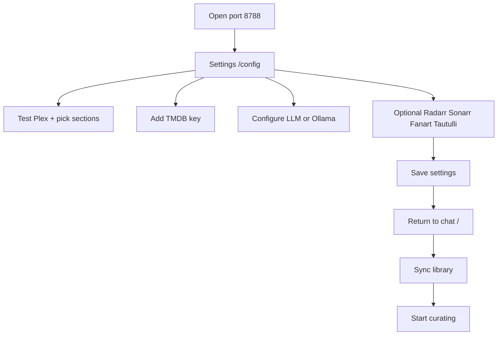
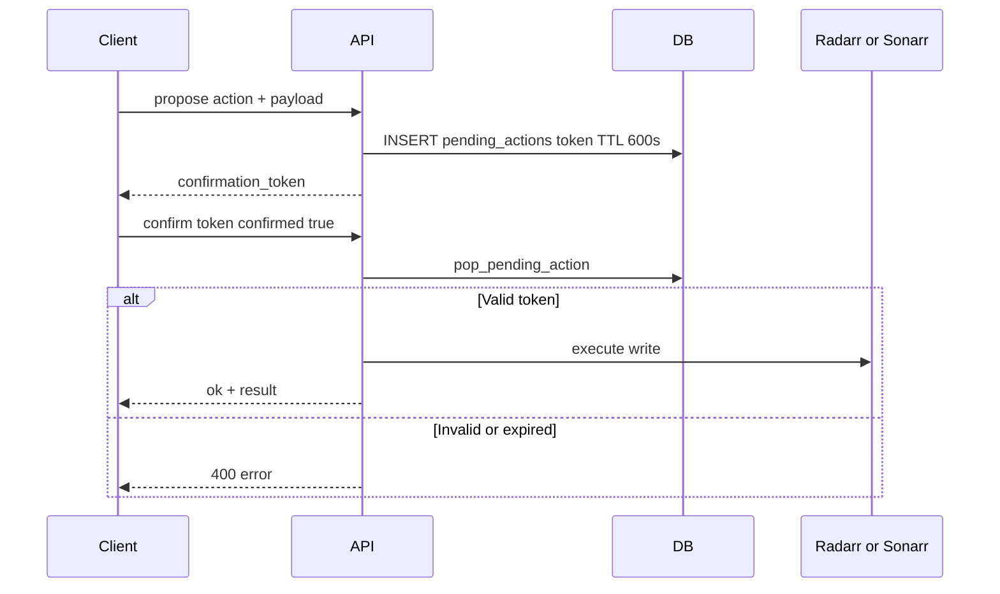

# MediaCurator — Design Document

This document describes product principles, user flows, UI/UX conventions, agent behavior, and API design for MediaCurator v0.1. It reflects **implemented behavior** in the codebase; items marked **Future** are planned but not shipped.

---

## Product principles

1. **Chat-first** — The curator conversation is the primary interface. Settings, sync, and title detail are supporting surfaces, not the main loop.

2. **Taste-aware, not generic** — Recommendations should reference what you own, watch, and have told the curator you love or dislike. TMDB discovery fills gaps; it does not replace library context.

3. **Explain the “why”** — Every title card can carry a `recommendation_reason` (library match score, “missing from collection”, purge rationale, etc.).

4. **Space-conscious curation** — Purge suggestions weigh file size, play history, staleness, and taste fit. MediaCurator complements disk-reclamation tools like Reclaimspace by helping you decide *what* to remove, not automating duplicate quarantine.

5. **Confirm before changing the fleet** — Adding or removing titles in Radarr/Sonarr always requires explicit confirmation. The agent is instructed never to bypass this.

6. **Bring your own provider** — LLM and embedding APIs are configurable. Ollama on the homelab host is a first-class path.

7. **Homelab pragmatism** — Single container, SQLite, no mandatory cloud services beyond TMDB (and your chosen LLM).

---

## User journeys

### Onboarding



Steps match [ONBOARDING.md](ONBOARDING.md). Setup status (`GET /api/setup/status`) drives the onboarding banner on the chat page until `onboarding_complete` is set.

### Genre exploration

**Intent:** “Explore neo-noir with me based on what I already love.”

1. User sends a natural-language message.
2. Agent calls `explore_genre` or `search_library` with genre/theme parameters.
3. Response includes owned titles plus TMDB titles not in library (`include_missing: true` by default).
4. Inline cards appear; user can expand via turnstyle viewport.
5. User dismisses poor fits (`dismiss` preference) or adds missing titles to *arr.

### Gap finding

**Intent:** “I love 70s paranoid thrillers — what’s missing?”

1. Agent calls `find_collection_gaps` with `media_type`, optional `year_from`/`year_to`, `genres`, `keywords`.
2. TMDB discover API returns candidates; owned TMDB IDs are filtered out.
3. Cards labeled “Missing from your collection”.
4. User confirms adds through Radarr/Sonarr flow.

### Watch tonight

**Intent:** “What should we watch tonight under 2 hours?”

1. Agent calls `what_to_watch_tonight` with optional `media_type`, `mood`, `limit`.
2. Without mood: ranks library items with low `view_count`, preferring unwatched or lightly watched.
3. With mood: delegates to semantic `search_library`.
4. Cards show in-library badges; no add buttons (already owned).

### Purge

**Intent:** “Which large files have never been watched?”

1. Agent calls `suggest_purge_candidates`.
2. Scoring favors large files, low play count, long staleness, and low taste match from preferences.
3. Optional Tautulli play stats augment Plex `view_count`.
4. User reviews reasons on cards; may follow up in chat or open title detail for purge notes.

**Future:** One-click “Remove from Radarr/Sonarr” from detail page using `remove_from_arr` confirmation flow.

---

## UI/UX design system

### Visual language

Dark **cinematic dashboard** aesthetic defined in `frontend/src/styles.css`:

| Token | Value | Usage |
|-------|-------|-------|
| `--bg` | `#0b0d12` | Page background with radial gradient |
| `--surface` / `--surface-2` | `#141925` / `#1b2233` | Cards, panels |
| `--text` / `--muted` | `#edf2ff` / `#9aa7c0` | Body / labels |
| `--accent` / `--accent-2` | `#6ea8ff` / `#9b7bff` | Buttons, links (gradient) |
| `--radius` | `16px` | Cards and containers |

Typography: **Inter** with system fallback. Eyebrow labels use uppercase tracking for section hierarchy.

### Layout regions

| Region | Component | Behavior |
|--------|-----------|----------|
| **Top bar** | `App.jsx` header | Title, library stats chip, Sync library, Settings link |
| **Onboarding banner** | Conditional | Links to `/config` when setup incomplete |
| **Chat thread** | `ChatThread` | Scrollable message list, user right-aligned styling |
| **Composer** | Textarea + submit | Multi-line prompts, disabled while loading |
| **Inline cards** | `TitleCard` compact | Horizontal wrap within assistant messages |
| **Turnstyle viewport** | Full-screen overlay | Horizontal track of full-size cards |

### Interaction patterns

- **Add to Radarr/Sonarr:** Native `window.confirm`, then propose + confirm API (double confirmation: dialog + server token).
- **Not interested:** POST preference signal without confirmation.
- **Expand results:** `action_prompt` block with `open_viewport` opens turnstyle overlay.
- **Title detail:** Route `/title/{movie|show}/{id}` — hero backdrop, metadata, purge note if applicable.

---

## Message block schema

Assistant (and user) messages are stored as an ordered list of **blocks**. Defined in `mediacurator/models/schemas.py`.

### Block types

| `type` | Fields | Purpose |
|--------|--------|---------|
| `text` | `content: str` | Prose reply from curator |
| `title_cards` | `items: TitleCard[]` | Inline poster cards |
| `action_prompt` | `action: str`, `payload: dict` | UI actions (currently `open_viewport`) |

User messages typically contain a single `text` block.

### Example assistant message

```json
{
  "id": "abc123",
  "role": "assistant",
  "blocks": [
    { "type": "text", "content": "Here are neo-noir picks missing from your shelf." },
    {
      "type": "title_cards",
      "items": [{ "media_type": "movie", "title": "Chinatown", "tmdb_id": 829, "in_library": false }]
    },
    {
      "type": "action_prompt",
      "action": "open_viewport",
      "payload": { "title": "Recommendations", "items": [] }
    }
  ]
}
```

The `action_prompt` payload uses `ViewportPayload` shape: `{ title, items }`.

---

## TitleCard and TitleDetail

### TitleCard

Core display model for chat cards and viewport. Fields:

| Field | Type | Description |
|-------|------|-------------|
| `media_type` | `"movie"` \| `"show"` | Content kind |
| `title` | string | Display title |
| `year` | int? | Release or first-air year |
| `tmdb_id` | int? | TMDB identifier (movies; also shows) |
| `tvdb_id` | int? | TVDB identifier (shows, Sonarr) |
| `rating_key` | string? | Plex rating key when in library |
| `poster_url` / `backdrop_url` | string | Art URLs |
| `overview` | string | Summary blurb |
| `rating` | float? | TMDB vote average when available |
| `genres` | string[] | Genre labels |
| `in_library` | bool | Present in Plex index |
| `in_radarr` / `in_sonarr` | bool | Present in *arr queue |
| `recommendation_reason` | string | Human-readable “why this card” |
| `runtime_minutes` | int? | Optional runtime |

### TitleDetail

Extends `TitleCard` with detail-page fields:

| Field | Type | Description |
|-------|------|-------------|
| `cast` / `directors` | string[] | Credits |
| `keywords` | string[] | TMDB keywords |
| `file_size_bytes` | int | Plex-reported size |
| `view_count` | int | Plex (+ Tautulli) plays |
| `last_viewed_at` | int? | Unix timestamp |
| `arr_id` | int? | **Future** — Radarr/Sonarr internal ID for remove actions |
| `purge_score` / `purge_reason` | float? / string | Purge heuristic output on detail page |

Detail API: `GET /api/title/{media_type}/{item_id}?id_type=tmdb|tvdb|rating_key`.

---

## Agent tool catalog

Tools are registered in `mediacurator/agent/tools.py` as OpenAI function schemas. The LLM selects tools; `ToolRegistry` executes them and collects cards.

| Tool | Inputs | Output | When invoked |
|------|--------|--------|--------------|
| `search_library` | `query`, optional `media_type` | Library matches via semantic + keyword search | Thematic questions about owned titles |
| `find_collection_gaps` | `media_type`, optional `year_from`, `year_to`, `genres`, `keywords` | TMDB discover minus owned IDs | “What am I missing?” / decade / genre gaps |
| `recommend_hidden_gems` | `media_type`, optional `query` | High-rated TMDB titles not owned (vote ≥ 7) | Discovery outside library |
| `suggest_purge_candidates` | optional `limit` | Large, unwatched/stale, low-taste items | Purge / space questions |
| `remember_preference` | `text` | Saves explicit taste fact | User states likes/dislikes |
| `add_to_radarr` | `tmdb_id`, optional `title` | `confirmation_token` | User wants a movie added |
| `add_to_sonarr` | `tvdb_id`, optional `title` | `confirmation_token` | User wants a show added |
| `remove_from_arr` | `media_type`, `arr_id`, optional `title`, `delete_files` | `confirmation_token` | User wants queue removal |
| `get_title_detail` | `media_type`, one of `tmdb_id`, `tvdb_id`, `rating_key` | Title metadata summary | Deep dive on one title |
| `explore_genre` | `genre`, `media_type`, optional `include_missing` | Library + TMDB genre browse | Genre exploration sessions |
| `what_to_watch_tonight` | optional `media_type`, `limit`, `mood` | Low-view-count or mood search picks | Tonight viewing |
| `analyze_watch_patterns` | none | JSON stats: top genres, unwatched, stale counts | Habits / analytics questions |

Side effects:

- Tools that return titles append to `ToolRegistry._cards` for UI rendering.
- Add/remove tools append to `ToolRegistry._pending_tokens` (also persisted in `pending_actions`).

### Fallback agent (no LLM)

When no provider is configured, `CuratorAgent._fallback_run` uses keyword routing:

- “purge”, “space”, “clunker” → `suggest_purge_candidates`
- “add”, “missing”, “gap”, “70s”, “genre” → `find_collection_gaps`
- “watch”, “tonight” → `search_library`
- Default → `search_library`

---

## BYOP LLM provider abstraction

Implemented in `mediacurator/agent/providers/__init__.py`.

### Chat providers

| Provider key | Class | Protocol |
|--------------|-------|----------|
| `openai_compatible` (default) | `OpenAICompatibleProvider` | POST `{base_url}/chat/completions` |
| `ollama` | `OpenAICompatibleProvider` | Same; default base `http://localhost:11434/v1` |
| `anthropic` | `AnthropicProvider` | POST `https://api.anthropic.com/v1/messages` |

Factory: `get_chat_provider(settings)` — requires `llm_api_key` unless provider is `ollama`.

Both providers implement:

- `chat(messages, tools?)` → full completion (used by agent)
- `stream(messages, tools?)` → async iterator (**Future** agent integration)

Anthropic tool schemas are converted from OpenAI function format to Anthropic `input_schema`.

### Embedding providers

`get_embedding_provider(settings)` → `OpenAIEmbeddingProvider` POST `{base_url}/embeddings`.

If `llm_api_key` is missing or the call fails, `embeddings._hash_embed` produces deterministic 384-dimensional vectors.

Configuration:

- `LLM_EMBEDDING_MODEL` (default `text-embedding-3-small`)
- `LLM_EMBEDDING_BASE_URL` (falls back to `LLM_BASE_URL` or OpenAI)

---

## Preference learning model

### Signal types

From `PreferenceSignal` (`mediacurator/models/schemas.py`):

| `signal_type` | Weight | Source |
|---------------|--------|--------|
| `explicit` | 2.0 | User statement or agent `remember_preference` |
| `positive` | 1.5 | **Future** — thumbs-up interactions |
| `negative` | -1.5 | **Future** — explicit dislike |
| `add` | 1.0 | **Future** — confirmed *arr add |
| `dismiss` | -0.5 | “Not interested” on a card |

Stored in `preference_facts` with optional `tmdb_id`, `tvdb_id`, `media_type` for title-scoped signals.

### Usage

1. **Agent system prompt** — Last N facts formatted as bullet list (`preference_context`).
2. **Purge scoring** — Genre overlap between item and preference text adjusts taste penalty.
3. **Future** — Weighted retrieval boosting in semantic search; Trakt import as bulk explicit signals.

API: `POST /api/preferences` with `PreferenceSignal` body.

---

## RAG and indexing design

### Index content

Each library row embeds concatenated text from:

- Title, year, summary, genres JSON, keywords JSON

Built by `build_item_embedding_text` during `rebuild_embeddings`.

### Search pipeline

1. Embed user query (`embed_text`).
2. `semantic_search` — cosine similarity against all stored vectors (optional `media_type` filter).
3. If no hits, fall back to SQL `LIKE` on title, summary, genres.
4. Map rows to `TitleCard` with similarity percentage in `recommendation_reason`.

### Storage

See [DATA_MODEL.md](DATA_MODEL.md) for `library_items` and `embeddings` tables. Vectors are JSON arrays in SQLite, not a dedicated ANN index.

**Future:** Incremental embedding updates, sqlite-vec extension, hybrid BM25 + vector ranking.

---

## ID normalization strategy

MediaCurator bridges three ID systems:

| ID | Source | Primary use |
|----|--------|-------------|
| **Plex `rating_key`** | Plex API | Library row primary key; detail lookup |
| **`tmdb_id`** | Plex GUID / TMDB | Movies; show discovery; Radarr adds |
| **`tvdb_id`** | Plex GUID / TMDB external_ids | TV shows; Sonarr adds |

### Plex GUID parsing

`parse_plex_guid` in `connectors/http.py` extracts:

- `themoviedb://{id}`
- `tvdb://{id}`
- `imdb://{id}` / legacy Plex IMDB agent format

Stored on library items as `tmdb_id`, `tvdb_id`, `imdb_id`.

### Normalization rules

- **Movies:** Radarr and gap discovery use `tmdb_id`. Library uniqueness is `rating_key`; TMDB ID indexed for lookups.
- **Shows:** Sonarr uses `tvdb_id`. TMDB still used for metadata/posters; `explore_genre` may fetch TV details to resolve TVDB from TMDB.
- **API detail route:** `id_type` query param selects lookup strategy (`tmdb` default, `tvdb` for shows, `rating_key` for Plex-native links).

**Future:** Canonical `titles` table linking all IDs; TVDB client wired into sync for show metadata parity.

---

## Confirmation token pattern

Destructive or fleet-changing operations use a two-phase commit:



Action types in `pending_actions`:

| `action_type` | Payload | Execute |
|---------------|---------|---------|
| `add_radarr` | `tmdb_id`, `title` | `RadarrClient.add_movie` |
| `add_sonarr` | `tvdb_id`, `title` | `SonarrClient.add_series` |
| `remove_arr` | `media_type`, `arr_id`, `delete_files` | delete movie/series |

Cancel: `POST /api/actions/confirm` with `confirmed: false` deletes token without side effects.

Agent tools that propose adds return tokens in tool JSON; the UI may also call `/api/actions/propose` directly from cards.

---

## API surface overview

Grouped by domain. All paths prefixed with `/api`.

### Health and setup

| Method | Path | Description |
|--------|------|-------------|
| GET | `/health` | Status and version |
| GET | `/setup/status` | Onboarding checks |
| GET | `/settings` | Masked settings |
| PUT | `/settings` | Save settings (merge secrets) |
| POST | `/setup/test/plex` | Test Plex connection |
| POST | `/setup/test/radarr` | Test Radarr |
| POST | `/setup/test/sonarr` | Test Sonarr |
| POST | `/setup/test/tmdb` | Test TMDB |
| POST | `/setup/test/tautulli` | Test Tautulli |
| GET | `/plex/sections` | List Plex libraries |

### Library and jobs

| Method | Path | Description |
|--------|------|-------------|
| POST | `/library/sync` | Start background sync job |
| GET | `/library/stats` | Counts and last sync |
| GET | `/jobs` | List jobs |
| GET | `/jobs/{job_id}` | Job detail and progress |

### Chat

| Method | Path | Description |
|--------|------|-------------|
| POST | `/chat` | Send message, full response |
| GET | `/chat/stream` | SSE stream (simulated deltas + complete) |

Query params for stream: `message`, optional `session_id`.

### Titles and actions

| Method | Path | Description |
|--------|------|-------------|
| GET | `/title/{media_type}/{item_id}` | Title detail (`id_type` query) |
| POST | `/actions/propose` | Create confirmation token |
| POST | `/actions/confirm` | Execute or cancel pending action |
| POST | `/preferences` | Record taste signal |

### Static / SPA

| Method | Path | Description |
|--------|------|-------------|
| GET | `/`, `/config`, `/title/...` | Serve `index.html` |
| GET | `/assets/*` | Vite build assets |

---

## Related documentation

- [ARCHITECTURE.md](ARCHITECTURE.md) — system context, deployment, data flows
- [DATA_MODEL.md](DATA_MODEL.md) — SQLite and schema reference
- [WEB_UI.md](WEB_UI.md) — route summary
- [CONFIGURATION.md](CONFIGURATION.md) — environment variables
