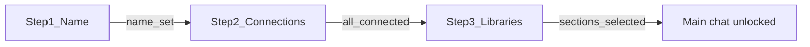

# CuratorX — Onboarding

Follow this checklist after deploying CuratorX (Docker, Unraid, or local dev). Default URL: **http://localhost:8788**.

---

## Guided onboarding wizard (3 cards)

Open **Admin** (`/admin`; the legacy `/config` path redirects here). First-time setup runs a **3-step gated wizard** — later steps stay locked until prior requirements succeed.

| Step | Name | Requirements to advance |
|------|------|-------------------------|
| 1 | Name | Enter curator name |
| 2 | Connections | Verify language model, Plex, Radarr, and Sonarr |
| 3 | Libraries | Select movie and TV Plex libraries (unlocked after Plex connects) |

**Finish** sets `onboarding_complete` when all four services are connected and both Plex sections are selected. Persona, optional enrichments, and household login live under **Settings** after setup.

### Plex library mapping

1. On step 2, enter the Plex **server** URL and **server token** (library access — separate from household Sign in with Plex), then click **Verify**.
2. After success, credentials collapse — manual text fields are hidden.
3. On step 3, choose **Movie library** and **TV library** from dropdowns (filtered by Plex section type).
4. Selections save immediately to `plex_movie_section` and `plex_tv_section`.

### LLM providers

| Provider | Default base URL |
|----------|------------------|
| OpenAI | `https://api.openai.com/v1` |
| Anthropic (Claude) | `https://api.anthropic.com` |
| Google Gemini | `https://generativelanguage.googleapis.com/v1beta/openai` |
| Groq | `https://api.groq.com/openai/v1` |
| Mistral | `https://api.mistral.ai/v1` |
| Together AI | `https://api.together.xyz/v1` |
| DeepSeek | `https://api.deepseek.com/v1` |
| OpenRouter | `https://openrouter.ai/api/v1` |
| Ollama | `http://localhost:11434/v1` |
| Custom OpenAI-compatible | User-defined |

Set `LLM_API_KEY` and `LLM_MODEL` in `.env` or Settings. Env-backed keys work for Verify/Test without re-entering them in the UI.

Successful LLM verification displays onboarding assistant hints in a 320px scroll panel.

Wizard progress is exposed at `GET /api/setup/wizard` with step keys `identity_seed`, `infrastructure`, and `dropdown_mapping`. Per-service certification status is at `GET /api/setup/certifications` (also embedded in the wizard payload as `certifications`). Active ambient context label is at `GET /api/context/active`.

On first visit to **Admin** (`/admin`), uncertified services with configured credentials are tested automatically (sequentially). Successful tests set `certified=1`; changing a service URL or API key clears certification until the next successful test.

---

## Index your library

1. Open **Admin** / **Settings** and click **Sync library** (or type `/sync` in chat when multi-user is off).
2. Watch progress in the **status dock** (phase, counts, percent) — or on the Admin library sync card.
3. Confirm stats via the top-bar movie/show counts (or `GET /api/library/stats`).

Job state is durable across container restarts. An interrupted job is marked failed; starting sync again resumes from the last valid phase checkpoint (≤72h) instead of redoing finished work.

---

## Ambient context (replaces manual lens switching)

CuratorX resolves conversational context automatically using rule-based signals (no ML pipeline required). The chat surfaces an ambient context tag under the thread title (default **General Exploration**) from `derived_contexts` via `GET /api/context/active`. The `derived_contexts` table stores lightweight context shells keyed by hash — this is a simple lookup, not an ML-derived clustering.

Legacy **curation lenses** remain available (API / advanced config) for backward compatibility but are not part of first-run onboarding.

---

## Start curating

Try these prompts:

- "I love 70s paranoid thrillers — what's missing from my collection?"
- "Show me hidden gems in sci-fi I don't own yet."
- "What should we watch tonight under 2 hours?"
- "Which large files have never been watched?"
- "Explore neo-noir with me based on what I already love."

Use the **single chat workspace** for everyday curation. Expand large title-card sets with the results overlay when needed.

---

## Warm library knowledge (after first sync)

Sync indexes identity and whatever Plex/TMDB return immediately. **Plot Lab motifs**, **embeddings**, and **neighbor graphs** fill in via the **idle scheduler** while the household is not chatting.

1. Leave CuratorX running overnight after the first full sync.
2. Owners: open **Admin → Scheduled Tasks** (`/admin/tasks`) and confirm `metadata_enrichment`, `semantic_embeddings`, `summary_motifs`, and `plot_neighbors` are enabled.
3. Open in-app Help at `/help` (or [HELP.md](HELP.md)) for role-aware guidance; read [CURATOR_KNOWLEDGE.md](CURATOR_KNOWLEDGE.md) for why motif walls can feel sparse and what coverage to expect over time.
4. Try **Plot Lab** (`/explore/plot-lab`) once motifs appear — empty chips mean the motif task has not finished a pass yet.

---

## Related documentation

- [HELP.md](HELP.md) — in-app Help (`/help`)
- [CURATOR_KNOWLEDGE.md](CURATOR_KNOWLEDGE.md) — knowledge depth & idle curation
- [CONFIGURATION.md](CONFIGURATION.md) — settings reference
- [WEB_UI.md](WEB_UI.md) — routes and chat features
- [wiki/Home.md](wiki/Home.md) — operator wiki
- [FAQ.md](FAQ.md) — common questions
- [curatorx_prd.md](archive/curatorx_prd.md) — product vision (archived / historical PRD)
