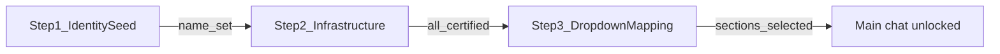

# CuratorX — Onboarding

Follow this checklist after deploying CuratorX (Docker, Unraid, or local dev). Default URL: **http://localhost:8788**.

---

## Guided onboarding wizard (v3.0 — 3 cards)

Open **Settings** (`/config`). First-time setup runs a **3-step gated wizard** — later steps stay locked until prior requirements succeed.

| Step | Name | Requirements to advance |
|------|------|-------------------------|
| 1 | Identity Seed | Enter curator name |
| 2 | Infrastructure Matrix | Verify LLM, Plex, Radarr, and Sonarr (certified badges) |
| 3 | Dropdown Mapping | Select movie and TV Plex libraries from dropdowns (unlocked after Plex verified) |

**Finish** sets `onboarding_complete` when all four services are certified and both Plex sections are selected. Persona sliders, optional metadata services, and legacy lenses are available in the **maintenance dashboard** after onboarding — they no longer block first-run setup.

### Plex library mapping

1. On step 2, enter Plex URL/token and click **Verify**.
2. After success, credentials collapse — manual text fields are hidden.
3. On step 3, choose **Movie library** and **TV library** from dropdowns (filtered by Plex section type).
4. Selections save immediately to `plex_movie_section` and `plex_tv_section`.

### LLM providers

| Provider | Default base URL |
|----------|------------------|
| OpenAI | `https://api.openai.com/v1` |
| Anthropic (Claude) | `https://api.anthropic.com` |
| Google Gemini | `https://generativelanguage.googleapis.com/v1beta/openai` |
| Groq | `https://api.groq.com/openai/v1` |
| Mistral | `https://api.mistral.ai/v1` |
| Together AI | `https://api.together.xyz/v1` |
| DeepSeek | `https://api.deepseek.com/v1` |
| OpenRouter | `https://openrouter.ai/api/v1` |
| Ollama | `http://localhost:11434/v1` |
| Custom OpenAI-compatible | User-defined |

Set `LLM_API_KEY` and `LLM_MODEL` in `.env` or Settings. Env-backed keys work for Verify/Test without re-entering them in the UI.

Successful LLM verification displays onboarding assistant hints in a 320px scroll panel.

Wizard progress is exposed at `GET /api/setup/wizard` with step keys `identity_seed`, `infrastructure`, and `dropdown_mapping`. Per-service certification status is at `GET /api/setup/certifications` (also embedded in the wizard payload as `certifications`). Active ambient context label is at `GET /api/context/active`.

On first visit to **Settings** (`/config`), uncertified services with configured credentials are tested automatically (sequentially). Successful tests set `certified=1`; changing a service URL or API key clears certification until the next successful test.

---

## Index your library

1. Open **Config** and click **Sync library** on the maintenance dashboard (or type `/sync` in chat when multi-user is off).
2. Watch progress in the **status dock** (phase, counts, percent) — or on the Config library sync card.
3. Confirm stats via `GET /api/library/stats` or the top-bar movie/show counts.

Job state is durable across container restarts; an interrupted sync is marked failed so you can start again cleanly.

---

## Ambient context (replaces manual lens switching)

CuratorX v3.0 infers conversational context automatically. The command bar shows an ambient label (default **General Exploration**) from `derived_contexts` via `GET /api/context/active`.

Legacy **curation lenses** remain in the maintenance dashboard for backward compatibility but are not part of first-run onboarding.

---

## Start curating

Try these prompts:

- "I love 70s paranoid thrillers — what's missing from my collection?"
- "Show me hidden gems in sci-fi I don't own yet."
- "What should we watch tonight under 2 hours?"
- "Which large files have never been watched?"
- "Explore neo-noir with me based on what I already love."

Use the **single chat workspace** for everyday curation. Expand large title-card sets with the results overlay when needed.

---

## Related documentation

- [CONFIGURATION.md](CONFIGURATION.md) — settings reference
- [WEB_UI.md](WEB_UI.md) — routes and chat features
- [wiki/Home.md](wiki/Home.md) — operator wiki
- [FAQ.md](FAQ.md) — common questions
- [curatorx_prd.md](curatorx_prd.md) — product vision (historical PRD)
