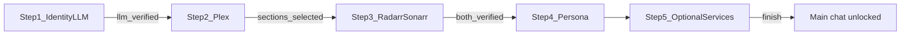

# CuratorX — Onboarding

Follow this checklist after deploying CuratorX (Docker, Unraid, or local dev). Default URL: **http://localhost:8788**.

---

## Guided onboarding wizard

Open **Settings** (`/config`). First-time setup runs a **5-step gated wizard** — later steps stay locked until prior verification succeeds.

| Step | Name | Requirements to advance |
|------|------|-------------------------|
| 1 | Identity & LLM | Verify LLM connection; set curator name |
| 2 | Media Core (Plex) | Verify Plex; select movie and TV section dropdowns |
| 3 | Automation | Verify Radarr and Sonarr (version + item counts shown) |
| 4 | Persona | Tune behavioral sliders (optional adjustment) |
| 5 | Optional services | TMDB, Fanart.tv, Tautulli — can skip |

**Finish** sets `onboarding_complete` and redirects to the chat UI. After onboarding, `/config` shows a **maintenance dashboard** for re-testing integrations, lens management, and advanced paths.

### LLM providers

| Provider | Default base URL |
|----------|------------------|
| OpenAI | `https://api.openai.com/v1` |
| Anthropic (Claude) | `https://api.anthropic.com/v1` |
| Google Gemini | `https://generativelanguage.googleapis.com/v1beta/openai` |
| Groq | `https://api.groq.com/openai/v1` |
| Mistral | `https://api.mistral.ai/v1` |
| Together AI | `https://api.together.xyz/v1` |
| DeepSeek | `https://api.deepseek.com/v1` |
| OpenRouter | `https://openrouter.ai/api/v1` |
| Ollama | `http://localhost:11434/v1` |
| Custom OpenAI-compatible | User-defined |

Set `LLM_API_KEY` and `LLM_MODEL` in `.env` or Settings. Env-backed keys work for Verify/Test without re-entering them in the UI.

Successful LLM verification displays onboarding assistant hints in a 320px scroll panel.

Wizard progress is exposed at `GET /api/setup/wizard`. Per-service certification status is at `GET /api/setup/certifications` (also embedded in the wizard payload as `certifications`). Service test results persist to `service_integrations` in SQLite, including a `certified` flag that skips repeat auto-tests on Config page load when credentials are unchanged.

On first visit to **Settings** (`/config`), uncertified services with configured credentials are tested automatically (sequentially). Successful tests set `certified=1`; changing a service URL or API key clears certification until the next successful test.

---

## Index your library

1. Click **Sync library** on the chat page (or `POST /api/library/sync`).
2. Wait for the background job to finish — Plex metadata, TMDB enrichment, and embeddings are rebuilt.
3. Confirm stats via `GET /api/library/stats`.

---

## Choose your lens

CuratorX scopes taste and chat by **curation lens**:

- Default: **`general`** — everyday discovery and viewing advice.
- Create additional lenses in Settings for isolated contexts (e.g. Director Studies, 70s Exploitation).
- Switch active lens from the Immersive sidebar or `PUT /api/lenses/active`.

Chat history under one lens does not appear when browsing another — this prevents casual watches from contaminating curated study lanes.

---

## Start curating

Try these prompts:

- "I love 70s paranoid thrillers — what's missing from my collection?"
- "Show me hidden gems in sci-fi I don't own yet."
- "What should we watch tonight under 2 hours?"
- "Which large files have never been watched?"
- "Explore neo-noir with me based on what I already love."

Use **Turnstyle** mode for quick one-liners; expand to **Immersive** for longer sessions with the full card grid.

---

## Related documentation

- [CONFIGURATION.md](CONFIGURATION.md) — settings reference
- [WEB_UI.md](WEB_UI.md) — routes and chat features
- [curatorx_prd.md](curatorx_prd.md) — product vision
