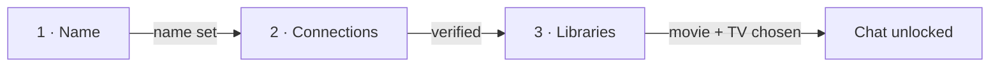

# CuratorX — Onboarding

Goal: get from a fresh container to a curator that knows your library. This is the task-first path an owner actually follows after deploying CuratorX (Docker, Unraid, or local dev). Default URL: **http://localhost:8788**.

The whole flow is four moves: **run it → connect your services → pick your libraries → sync and let it learn.** Everything below shows the shortest path first, then explains why.

---

## 1. Run CuratorX

Pick whichever matches how you host. All three land on the same setup wizard.

### Docker (single command)

```bash
docker run -d --name curatorx \
  -p 8788:8788 \
  -v /path/to/curatorx/config:/config \
  romwil/curatorx:latest
```

### Docker Compose (env-seeded)

```bash
git clone https://github.com/romwil/curatorx.git
cd curatorx
cp .env.example .env      # optional: pre-fill keys so Verify passes without typing them in the UI
docker compose up -d
```

### Unraid

Install from **Community Applications** (search "CuratorX"), or add the container with repository `romwil/curatorx:latest`, port `8788`, and config path `/mnt/user/appdata/curatorx/config → /config`. Full steps: [Wiki → Unraid](wiki/Unraid.md).

Open **http://localhost:8788** (or your host's IP). A first-time setup wizard appears automatically.

---

## 2. Connect your services (setup wizard)

Open **Admin** (`/admin`; the legacy `/config` path redirects here). First-time setup runs a **3-step gated wizard** — each step unlocks the next once its requirements pass, so you can't get stuck in a half-configured state.



| Step | You do | Advances when |
|------|--------|---------------|
| **1 · Name** | Name your curator | A name is entered |
| **2 · Connections** | Verify your **LLM**, **Plex**, and (optionally) **Radarr**/**Sonarr** | Each service you configured verifies green |
| **3 · Libraries** | Choose your **Movie** and **TV** Plex libraries | Both are selected (unlocked after Plex verifies) |

Setup completes when your configured services are connected and both Plex libraries are chosen. Persona, optional enrichments, and household login all live under **Settings** afterward — they're not required to start curating.

### Connect Plex

On step 2, enter your Plex **server URL** and **server token**, then click **Verify**. This server token is for *library access* and is separate from household "Sign in with Plex" login.

- Get a server token: open any item in Plex Web → **⋮ → Get Info → View XML**, and copy the `X-Plex-Token` value from the URL.
- After a green verify, the credential fields collapse. On step 3, pick your **Movie library** and **TV library** from the dropdowns (filtered to the right section type).

Prefer to seed it from the environment? In Compose:

```yaml
# docker-compose.yml (excerpt)
services:
  curatorx:
    image: romwil/curatorx:latest
    ports: ["8788:8788"]
    volumes: ["/mnt/user/appdata/curatorx/config:/config"]
    environment:
      PLEX_URL: "http://your-plex-host:32400"
      PLEX_TOKEN: "YOUR_PLEX_SERVER_TOKEN"
      TMDB_API_KEY: "YOUR_TMDB_KEY"
      LLM_API_KEY: "YOUR_LLM_KEY"
      LLM_MODEL: "gpt-4o-mini"
```

### Connect your LLM

Chat needs an LLM. Set the provider base URL, model, and key in the wizard, or seed them via `.env` / environment. Common providers:

| Provider | Base URL |
|----------|----------|
| OpenAI | `https://api.openai.com/v1` |
| Anthropic (Claude) | `https://api.anthropic.com` |
| Google Gemini | `https://generativelanguage.googleapis.com/v1beta/openai` |
| Groq | `https://api.groq.com/openai/v1` |
| Mistral | `https://api.mistral.ai/v1` |
| Together AI | `https://api.together.xyz/v1` |
| DeepSeek | `https://api.deepseek.com/v1` |
| OpenRouter | `https://openrouter.ai/api/v1` |
| Ollama (fully local) | `http://localhost:11434/v1` |
| Custom OpenAI-compatible | Your endpoint |

```dotenv
# .env — seed the LLM so the wizard's Verify passes without re-typing the key
LLM_API_KEY=YOUR_LLM_KEY
LLM_MODEL=gpt-4o-mini
# For a local model instead, point at Ollama and leave the key blank:
# LLM_BASE_URL=http://localhost:11434/v1
# LLM_MODEL=llama3.1
```

Want a fully private setup with nothing leaving your LAN? Point the LLM at a local **Ollama** endpoint.

### Connect Radarr / Sonarr / TMDB (optional but recommended)

- **TMDB** deepens metadata (overviews, cast, posters) without an LLM — set `TMDB_API_KEY`.
- **Radarr / Sonarr** let the curator *propose* adds/removals (always confirm-gated — nothing is written without your explicit OK). Enter each service's URL + API key on step 2 and Verify.

```dotenv
# .env — connect *arr so the curator can propose (never silently perform) adds
RADARR_URL=http://your-host:7878
RADARR_API_KEY=YOUR_RADARR_KEY
SONARR_URL=http://your-host:8989
SONARR_API_KEY=YOUR_SONARR_KEY
```

---

## 3. Index your library (first sync)

1. From **Admin / Settings**, click **Sync library** (or type `/sync` in chat while multi-user is off).
2. Watch progress in the **status dock** (phase, counts, percent) or the Admin library-sync card.
3. Confirm the counts land in the top bar.

Prefer the terminal?

```bash
curl -s -X POST http://localhost:8788/api/library/sync    # start the index job
curl -s http://localhost:8788/api/library/stats | python3 -m json.tool   # movie/show counts + last sync
```

**Why it's safe to interrupt:** sync state is durable across container restarts. An interrupted job is marked failed; starting sync again resumes from the last valid phase checkpoint (≤72h) instead of redoing finished work.

---

## 4. Let the library get smart (idle enrichment)

Sync indexes identity and whatever Plex/TMDB return immediately. **Plot Lab motifs**, **embeddings**, and **neighbor graphs** fill in afterward via the **idle scheduler**, while the household isn't chatting.

1. Leave CuratorX running (overnight after a first full sync is ideal).
2. Open **Admin → Scheduled Tasks** (`/admin/tasks`) and confirm `metadata_enrichment`, `semantic_embeddings`, `summary_motifs`, and `plot_neighbors` are enabled.
3. Try **Plot Lab** (`/explore/plot-lab`) once motifs appear — empty chips just mean the motif task hasn't finished a pass yet.

**Why coverage starts sparse:** materialized layers (motifs, neighbors) are built by idle tasks, not at query time — that's what keeps Chat and Explore fast. The knowledge-coverage strip is an honest to-do list, not a fault. Full why/what/how: [CURATOR_KNOWLEDGE.md](CURATOR_KNOWLEDGE.md).

---

## 5. Start curating

Ask your curator something real:

- "I love 70s paranoid thrillers — what's missing from my collection?"
- "Show me hidden gems in sci-fi I don't own yet."
- "What should we watch tonight under 2 hours?"
- "Which large files have never been watched?"
- "Explore neo-noir with me based on what I already love."

The chat surfaces a small **ambient context** tag under the thread title (default *General Exploration*) that shifts as the conversation's mood does — no manual "lens" switching required.

---

## Optional: open it up to the household

Multi-user is **off by default** — a single trusted operator, no login screen. When you're ready to let household members sign in and keep their own chats/watchlists/ratings separate, enable multi-user and pick your sign-in methods (Plex PIN, local password, and/or OIDC). Step-by-step: [Wiki → Multi-User](wiki/Multi-User.md). Seerr request routing for members: [Wiki → Seerr](wiki/Seerr.md).

---

## Related documentation

- [HELP.md](HELP.md) — in-app Help (`/help`)
- [CURATOR_KNOWLEDGE.md](CURATOR_KNOWLEDGE.md) — knowledge depth & idle curation
- [CONFIGURATION.md](CONFIGURATION.md) — full settings reference
- [WEB_UI.md](WEB_UI.md) — routes and chat features
- [FAQ.md](FAQ.md) — common questions
- [DOCS_STYLE.md](DOCS_STYLE.md) — how these docs are written
